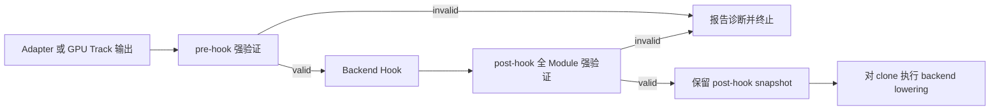

# AnchorIR 结构化强验证与 Golden 回归

本文档说明 T6.5 在 `triton-anchor` 中的实现边界、对外接口和一键验收方法。它是开发者面向的实现与测试指南；AnchorIR 方言合同的规范性唯一来源仍是 `python/triton_anchor/spec/anchor-ir-*.json`。

## 1. 目标与范围

T6.5 将 AnchorIR 从“文本或顶层 Operation 名称检查”提升为结构化、版本化且 fail-closed 的合同边界，并为关键编译阶段建立稳定的规范化和 Golden 比较语义。实现覆盖：

- 有界遍历 `Operation`、`Region`、`Block`、`Type` 和 `Attribute`，完成结构/语义检查与 verifier 安全预检，只在安全且无违规时调用 MLIR verifier；
- 按 `spec_version + track + phase` 解析不可变规则，区分未知方言、显式 Forbidden 和跨对象语义不变量；
- 使 C++ 核心、Python API 和 CLI 共用同一份 `AnchorIRValidationReport` 结果模型；
- 统一 Adapter 输出、pre-hook、Backend Hook、post-hook 和 backend lowering 的执行顺序；
- 为合法 IR 生成稳定规范化文本和 SHA-256，并在 Golden 回归中定位首个发生偏移的 Stage；
- 提供 Linalg 与 TritonGPU 两条 Track 的正例、反例和关键阶段 Golden 样本。

## 2. 实现结构

| 层次 | 主要文件 | 职责 |
|---|---|---|
| 版本化规则 | `python/triton_anchor/spec/anchor-ir-1.0.0.json`<br>`python/triton_anchor/spec/anchor-ir-1.1.0.json` | 定义各 Track 的 allowed/forbidden 方言、语义不变量和稳定诊断模板。 |
| 规则解析 | `python/triton_anchor/anchor_ir_rules.py` | 校验版本、Track、Phase 和扩展声明，将 JSON 解析为不可变 policy。 |
| 诊断模型 | `python/triton_anchor/anchor_ir_schema.py` | 定义 Track/Phase、错误码、对象种类、Operation/Object 路径、Source Location 和修复提示。 |
| C++ 结构化核心 | `csrc/lib/Validation/AnchorIRValidator.cpp`<br>`csrc/include/triton-anchor/Validation/AnchorIRValidator.h` | 对真实 `mlir::ModuleOp` 执行有界结构遍历、Type/Attribute 递归检查、双 Track 语义规则与 verifier 安全预检，在无违规后再调用 MLIR verifier。 |
| Python 结构化 API | `python/triton_anchor/anchor_ir_validator.py`<br>`csrc/bindings/triton_anchor_validator.cc` | 封装 C++ 核心，对 ModuleOp 和文本输入返回同一结构化报告。 |
| 生命周期 | `python/triton_anchor/anchor_ir_lifecycle.py`<br>`python/triton_anchor/pipeline.py`<br>`python/triton_anchor/adapters/base.py` | 在 Hook 前后强制全 Module 验证，阻止失败后继续执行 Hook 或 lowering。 |
| 规范化与 Golden | `python/triton_anchor/anchor_ir_normalizer.py`<br>`python/triton_anchor/anchor_ir_golden.py` | 生成稳定文本/SHA-256，记录 Stage manifest，并报告首个偏移 Stage、新旧哈希和规范化 IR diff。 |
| CLI | `python/triton_anchor/anchor_ir_cli.py` | 提供 `triton-anchor-validate`，支持 text/JSON 输出及稳定退出码。 |
| 语料与测试 | `python/triton_anchor/tests/data/anchor_ir/`<br>`python/triton_anchor/tests/test_anchor_ir_*.py` | 覆盖两条 Track 的正反例、资源限制、生命周期、CLI/API、规范化和 Golden。 |

当前默认规则版本是 `anchor-ir/1.1.0`，同时保留 `anchor-ir/1.0.0` 以便显式重放旧合同。`1.1.0` 的 Linalg Track 允许 15 个核心方言，TritonGPU Track 允许 9 个核心方言；`1.0.0` 的 TritonGPU Track 为 8 个，`1.1.0` 在该 Track 新增 `cf`。C++ 不复制这些白名单，而是使用 Python 根据选定 JSON 构造的 policy。

## 3. 强制生命周期与调用方式



pre-hook 只允许选定 Track 的核心规则；失败时 Hook 和 lowering 都不执行。post-hook 重新检查 Hook 修改后的整个 Module，只允许 Hook 通过 `get_allowed_dialects()` 声明的非核心扩展；核心 Forbidden 不能被扩展覆盖。ModuleOp 路径的 lowering 接收已验证 Module 的 clone，不会改写报告中的 post-hook 边界快照；文本路径则传递已验证的不可变字符串。

Linalg Adapter 的生产接入应调用：

```python
report = adapter.compile(
    ttir_module,
    metadata,
    hook=backend_hook,
    backend_lowering=lower_to_binary,
    context=ttir_module.context,
)
binary = report.lowered_output
```

`adapter.compile()` 内部调用 `run_anchor_ir_compilation()`。TritonGPU Track 或不经 Linalg Adapter 的外部后端应直接调用 `AnchorIRLifecycleOrchestrator.run_module_or_raise()`。不应在生产管线中只调用低层 `adapter.convert()` 后直接 lowering。

`triton.compiler.compile()` 只执行后端注册的 stages，本仓库无法自动拦截所有 out-of-tree 后端。因此，外部后端必须按 [自定义硬件后端指南](custom_backend.md) 把上述 fail-closed 入口放入自己的编译 stage。

`python/triton_anchor/anchor_ir.py` 中的 `AnchorIRValidator`（包括
`validate()`、`is_valid()`、`validate_and_raise()` 和
`validate_pre_hook()/validate_post_hook()`）仅是 legacy regex 兼容扫描。
它不解析 MLIR，不能检查嵌套 Region、Type、Attribute、Properties、verifier
或 Track 语义，因此不是 production AnchorIR gate；新接入应使用
`StructuredAnchorIRValidator` 或上述统一生命周期入口。

### Python API 和 CLI

```python
from triton_anchor import (
    ANCHOR_IR_SPEC_VERSION,
    AnchorIRPhase,
    AnchorIRTrack,
    StructuredAnchorIRValidator,
)

report = StructuredAnchorIRValidator().validate_text(
    mlir_text,
    spec_version=ANCHOR_IR_SPEC_VERSION,
    track=AnchorIRTrack.LINALG,
    phase=AnchorIRPhase.PRE_HOOK,
    source_name="input.mlir",
)
if not report.valid:
    for diagnostic in report.diagnostics:
        print(diagnostic.code, diagnostic.operation_path, diagnostic.hint)
```

```bash
triton-anchor-validate input.mlir \
  --spec-version anchor-ir/1.1.0 \
  --track linalg \
  --phase pre_hook \
  --format json
```

CLI 对合法 IR 返回 `0`，对合同不合法 IR 返回 `1`，对命令行用法错误返回 `2`。JSON 输出与 Python API 的 `report.to_dict()` 使用同一序列化模型。

## 4. 规范化与 Golden

`AnchorIRNormalizer` 只为通过强验证的 IR 生成可接受 Golden；不合法 IR 的 `normalized_text` 和 `sha256` 均为 `None`。当前规范化版本是 `anchor-ir-normalization/1.0.0`，输出固定为 UTF-8、LF 换行和一个末尾换行，SHA-256 直接基于规范化字节计算。

Golden Stage ID 与验证 Phase 是两个不同概念：

- Phase 只有 `pre_hook` 和 `post_hook`，决定采用哪个验证 policy；
- Stage 是回归观测点，必须以 `adapter.output` 开始、以 `boundary.post_hook` 结束，中间可以有零到多个 `pass.<stable-name>.after` 和 `hook.<stable-name>.after`，并按 Adapter、Pass、Hook、Boundary 分组排序。

`compare_anchor_ir_golden()` 按 Stage 顺序比较 manifest，第一个不同的 Stage 即停止，并返回旧哈希、新哈希和规范化 IR diff。样本 manifest 位于 `python/triton_anchor/tests/data/anchor_ir/golden/`。

Golden manifest 输入受 JSON 大小、嵌套深度、Stage 数量和累计规范化 IR 字节预算约束。默认 Context 会对不同的 `phase + extension_dialects + payload` 组合进行隔离重验，复用相同组合的成功结果，并共享 60 秒 manifest 级总时限。为了动态注册厂商 parser 而显式传入 `context=` 时会改用进程内兼容路径，该路径不能强制墙钟超时，因此只能处理调用方信任的 IR。

## 5. 一键验收

本分支提交脚本 `scripts/verify_t65_all.py`。默认只验证脚本所在的当前工作区，因此 PR 拉取者无需复制本机目录结构；其他 Triton 版本分支合入同名脚本后，也可在各自工作区独立执行。

### 前置条件

- Linux/POSIX 环境，并可使用 `git`、`/bin/sh`、符号链接和 `LD_LIBRARY_PATH`；
- 已按仓库 README 完成当前工作区的构建和安装；
- 当前工作区存在 `build/lib.*/triton/_C/libtriton.so`；
- 选中的 Python 环境已安装 `pytest`，且存在可运行的 `triton-anchor-validate` console-script 前置条件。

在工作区根目录执行：

```bash
./scripts/verify_t65_all.py \
  --summary-json build/t65-summary.json
```

`build/t65-summary.json` 位于 Git 已忽略的构建目录，适合作为本地或 CI 机器可读证据。如需指定解释器，使用 `--python /path/to/python` 或环境变量 `T65_PYTHON`。

脚本会为所有 Python 子进程使用 `-S`、显式 `PYTHONPATH` 和本地动态库路径。它要求 `triton_anchor` 精确来自当前工作区的 `python/triton_anchor`，而 `triton` 与 `libtriton.so` 精确来自本工作区选定的规范 `build/lib.*` 产物。这同时防止其他 editable install 串包和旧 `build/lib.*/triton_anchor` 副本掩盖当前待提交源码。

脚本默认执行：

1. 工作区和暂存区 `git diff --check`；
2. 导入路径、Triton 版本和当前工作区 `libtriton.so` 的隔离探测；
3. TTIR→TTGPU converter 能力检测、编译产物和所选 Python 环境的 CLI console-script 前置检查；
4. `python/triton_anchor/tests` 中的 AnchorIR 专项全集（其中静态核对当前 `setup.py` 的 CLI entry point 和 T6.5 资源打包规则）；
5. `tests/test_smoke.py` 的 pytest 和脚本两种入口；
6. 同一非法 IR 的 Python API/CLI JSON 报告逐字段一致性及合法/非法退出码；
7. `scripts/verify_t65.py` 的人类可读验收演示，包括结构化诊断、生命周期、稳定哈希和首次 Golden 偏移定位。

任一必选步骤失败时脚本以非零退出，JSON 中保留每一步的 `PASS/FAIL/SKIP`、耗时、返回码和输出尾部。当前分支未暴露某项可选能力时会明确记录 `SKIP`，而不会假装已验证。

整体退出码为：无 `FAIL` 时返回 `0`，任一步失败时返回 `1`，参数或目标选择错误时返回 `2`，用户中断时返回 `130`。单步超时在 JSON 中记为 `124`，并使整体返回 `1`。由于 JSON 包含运行耗时和日志尾部，它是验收报告而不是字节稳定的 Golden；评审时还应检查 `SKIP` 数量及原因。

可选参数：

```bash
# 显示各步完整输出
./scripts/verify_t65_all.py --verbose

# 额外运行仓库根目录 pytest（可能收集 FlagGems/硬件依赖测试）
./scripts/verify_t65_all.py --include-root-pytest

# 仅在本地同时维护多个相邻工作区时使用
./scripts/verify_t65_all.py --all-worktrees
```

## 6. 验收边界

一键脚本是 T6.5 的仓内源码级一键回归入口，但它不会：

- 自动构建 Triton/LLVM、创建虚拟环境或安装依赖；
- 代替发布阶段的全新虚拟环境 wheel 安装与 ABI 检查；
- 代替 T10.3 的通用 corpus runner、强制 cache-miss 真实编译采集和多后端编排；
- 自动把 AnchorIR 生命周期注入任意 out-of-tree backend；
- 代替厂商 lowering、设备运行时或硬件正确性验收；
- 默认执行 `tests/test_backend_smoke.py` 或 `tests/test_ops.py`：前者要求已安装的企业后端 entry point，后者还要求 Torch 和真实设备，均属于外部后端/硬件验收；
- 默认运行可能收集 FlagGems 或额外硬件依赖的根目录 pytest。

因此，T6.5 PR 的仓内验收以本脚本的必选项全部通过为准；真实编译管线的 corpus 采集和外部后端强制接入仍需 T10.3 与后端 PR 分别提供证据。
