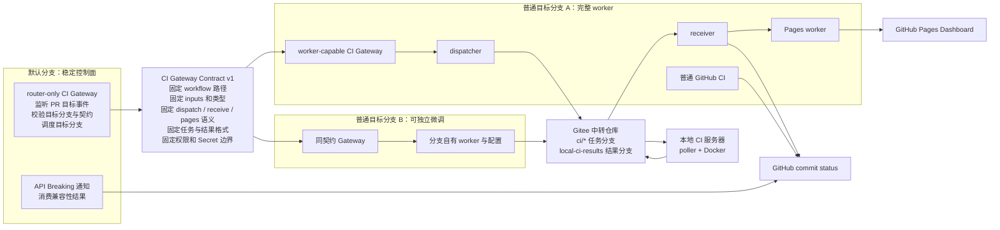

# 多分支 CI 架构与责任边界

本文用于单独说明多分支 CI 拆分后的职责边界和维护契约。文档只使用通用角色名称，不绑定具体分支名。

## 目标

CI 被拆成默认分支控制面和普通目标分支执行层。默认分支提供稳定入口，负责接收可信事件、校验 PR 目标分支和分发请求；普通目标分支提供完整 worker，负责本分支实际测试、结果接收和页面刷新。

这样做的目的不是让所有分支共享完全相同的测试实现，而是让不同分支可以独立微调 CI，同时通过一个版本化契约保证默认分支能够可靠调用目标分支。

## 架构图

## 文件与职责

下面按文件名对比默认分支和普通目标分支中的职责。同一路径的 workflow 可以因所在分支不同而承担不同角色。

| 文件 | 默认分支职责 | 普通目标分支职责 |
| --- | --- | --- |
| `.github/workflows/ci-gateway.yml` | 作为 router-only Gateway，监听 PR 目标事件、检查目标分支是否具备完整 worker 和兼容契约，并按 `base.ref` 调度该分支 | 作为 worker-capable Gateway，校验并处理 `dispatch`、`receive`、`pages` 请求，再调用对应 reusable workflow |
| `.github/workflows/api-breaking-notify.yml` | 通过 `workflow_run` 消费 Public API Compatibility 结果，校验结果后写入 PR 或 commit 通知 | 不参与当前运行；即使保留副本，系统也只依赖默认分支上的版本 |
| `.github/workflows/api-compat.yml` | router-only 部署形态下不保留 | 运行公共 API 对比并发布兼容性结果，供默认分支的通知 workflow 消费 |
| `.github/workflows/dispatch-local-ci.yml` | router-only 部署形态下不保留 | 必需 worker；解析精确提交、创建 Gitee task ref、写入 pending 状态并启动 receiver |
| `.github/workflows/receive-local-ci-result.yml` | router-only 部署形态下不保留 | 必需 worker；轮询和续接本地结果、回写 GitHub 状态，并按任务类型请求 Pages 刷新 |
| `.github/workflows/backend-status-pages.yml` | router-only 部署形态下不保留 | 必需 worker；同步当前分支 push/full 结果、校验 Dashboard 数据并部署 Pages |
| `.github/workflows/ci.yml` | router-only 部署形态下不保留 | 分支自有 CI；执行 Ruff、格式检查和纯 Python 单元测试 |
| `.github/workflows/delivery-ci.yml` | router-only 部署形态下不保留 | 分支自有 CI；执行 CI 脚本预检、性能契约和手动容器化 smoke |

普通目标分支启用 Local CI 时，`ci-gateway.yml`、dispatcher、receiver 和 Pages workflow 是默认分支 router 会检查的必需文件。`ci.yml`、`delivery-ci.yml` 和 `api-compat.yml` 属于普通目标分支可独立维护的 CI；`api-breaking-notify.yml` 只需要由默认分支提供。

| 支撑文件或目录 | 默认分支职责 | 普通目标分支职责 |
| --- | --- | --- |
| `scripts/local_ci/` | 不执行本地测试逻辑 | 提供任务轮询、测试执行、结果发布、状态回写和性能比较脚本 |
| `scripts/dashboard/`、`dashboard/` | 不构建或部署 Dashboard | 提供结果同步、数据契约、静态页面资源和部署输入 |
| `scripts/api_contract/`、`api_contract/` | 不执行 API 对比 | 定义公共 API 范围并执行兼容性检查 |
| `docker/build-env.Dockerfile` | 不构建测试镜像 | 为手动容器化 full smoke 提供构建环境 |

## 自动链路

```mermaid
flowchart TB
  subgraph PRFlow["PR Local CI"]
    PR["PR 事件<br/>目标为普通目标分支"]
    DefaultRouter["默认分支 CI Gateway"]
    Inspect["读取 PR base commit<br/>检查 worker 文件与契约版本"]
    TargetGatewayDispatch["普通目标分支 CI Gateway<br/>mode=dispatch"]
    DispatcherPR["dispatcher<br/>生成 PR head 与 base task ref"]
    RelayPR["Gitee 中转仓库"]
    LocalPR["本地 CI 服务器"]
    ReceiverPR["普通目标分支 CI Gateway<br/>mode=receive"]
    StatusPR["GitHub commit status"]

    PR --> DefaultRouter --> Inspect --> TargetGatewayDispatch --> DispatcherPR --> RelayPR
    RelayPR --> LocalPR --> RelayPR --> ReceiverPR --> StatusPR
  end

  subgraph PushFlow["普通目标分支 push Local CI"]
    Push["push 到普通目标分支"]
    DispatcherPush["该分支 dispatcher<br/>生成 push task ref"]
    RelayPush["Gitee 中转仓库"]
    LocalPush["本地 CI 服务器"]
    ReceiverPush["该分支 CI Gateway<br/>mode=receive"]
    StatusPush["GitHub commit status"]
    PagesGateway["该分支 CI Gateway<br/>mode=pages"]
    Pages["GitHub Pages Dashboard"]

    Push --> DispatcherPush --> RelayPush
    RelayPush --> LocalPush --> RelayPush --> ReceiverPush --> StatusPush
    ReceiverPush --> PagesGateway --> Pages
  end
```

## 固定契约

| 契约内容 | 要求 |
| --- | --- |
| workflow 路径 | 固定为 `.github/workflows/ci-gateway.yml` |
| contract version | 默认分支 router 和普通目标分支 gateway 必须一致 |
| `workflow_dispatch.inputs` | 名称、类型、默认值和含义必须兼容 |
| `mode=dispatch` | 只表示经过默认分支校验后的 PR 任务投递 |
| `mode=receive` | 只表示接收某个已知 task ref 的本地结果 |
| `mode=pages` | 只表示刷新当前普通目标分支对应的 Dashboard 数据 |
| task ref 格式 | 遵循 `ci/pr-*`、`ci/base/*`、`ci/push/*`、`ci/full/*` |
| 结果目录格式 | 遵循本仓库结果路径契约 |
| 权限边界 | 默认分支 router 不读取 `GITEE_TOKEN`；只有普通目标分支 worker 获取 secret |
| 升级顺序 | 先让普通目标分支支持新契约，再升级默认分支 router |

## `ci-gateway.yml` 的职责

`ci-gateway.yml` 是多分支 CI 的统一入口、路由器和契约层，本身不承载具体测试逻辑。它负责按 mode 分流、做安全校验，并调用目标分支上的 worker workflow。

| 职责 | 说明 |
| --- | --- |
| `route-pull-request` | 默认分支接收 PR 目标事件，读取 PR 的目标分支和 base commit，并把请求路由到普通目标分支自己的 gateway |
| `validate-dispatch` | 在普通目标分支上复核 PR 状态、head/base SHA、目标分支、gateway commit 和 contract version |
| `validate-receive` | 校验结果接收请求中的 `task_ref`、`source_branch` 和 contract version，避免错误分支或旧任务回写状态 |
| `validate-pages` | 限制 Dashboard 刷新只能来自当前普通目标分支的 push/full 结果 |
| worker 调用 | 通过 reusable workflow 调用 `dispatch-local-ci.yml`、`receive-local-ci-result.yml` 和 `backend-status-pages.yml` |

真正执行本地测试的是 `Gitee 中转仓库 -> 本地服务器 poller -> Docker/本地环境` 这条链路。`ci-gateway.yml` 只收住“谁可以触发、触发哪个分支、传哪些参数、什么时候能拿 secret、结果是否允许刷新页面”这些边界。

## 可由普通目标分支自行维护的内容

- 测试阶段和测试命令。
- 后端类型、构建参数、环境初始化方式。
- FlagGems 测试范围、白名单和超时策略。
- 性能指标、基线读取方式和 warning 阈值。
- 是否启用某些可选测试。
- worker 内部脚本实现。
- Dashboard 数据来源对应的本分支 push/full 结果。

## 当前边界

默认分支只保留 router-only gateway 时，默认分支提供的是公共调度入口，不提供完整 worker。PR 和普通目标分支 push 是当前稳定自动链路。

手动 full 算子测试和手动容器化 smoke 属于可扩展入口。若需要作为公共能力开放，应新增 gateway mode，或在默认分支成套引入完整 worker 文件。
