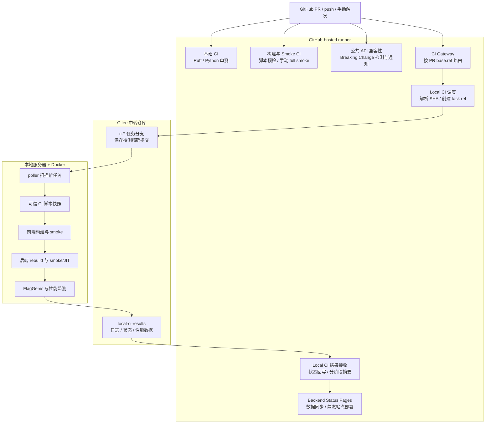
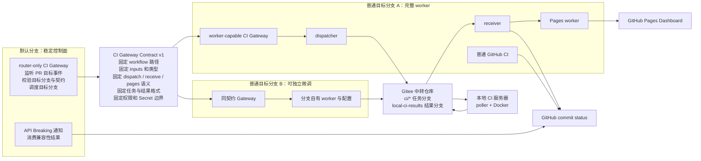

# triton-anchor CI 说明

## 1. 文档目的

本文档说明 `triton-anchor` 当前持续集成系统的设计思路、功能范围、触发方式、执行流程、结果流转和日常使用方法，供项目开发、后端适配和 CI 维护人员参考。

当前 CI 由两类执行环境共同组成：

- GitHub-hosted runner：执行代码规范检查、纯 Python 单元测试、CI 脚本检查、公共 API 兼容性检查、容器化构建与 smoke，以及静态状态页面构建。
- 本地服务器和 Docker 容器：执行依赖本地 LLVM/PPL、目标后端和运行环境的构建、smoke/JIT、FlagGems 和性能监测。

两类环境通过 GitHub workflow、Gitee 中转仓库和 GitHub commit status 连接。GitHub 是开发入口和状态展示入口，Gitee 保存本地任务引用及运行结果，本地服务器负责重型测试。

本文档只描述 CI，不涉及软件包发布和版本发布流程。

## 2. 总体设计

### 2.1 为什么拆成 GitHub CI 和 Local CI

`triton-anchor` 的检查可以分为两类：

1. 不依赖特定后端的检查，例如 Ruff、纯 Python 单元测试、脚本语法检查和公共 API 对比。这些检查适合在 GitHub-hosted runner 上快速执行。
2. 依赖本地工具链和目标后端的检查，例如重新编译前端、重新构建目标后端、运行后端 smoke/JIT、FlagGems 和性能监测。这些任务依赖预置环境、运行时间较长，更适合放在本地服务器。

因此，系统没有要求 GitHub runner 直接访问本地服务器，而是采用 Gitee 仓库作为异步中转层：GitHub 将精确提交推送成任务分支，本地服务器主动轮询任务，完成后将结果发布回 Gitee，GitHub 再读取结果并更新状态。

整体链路采用“公共调度与结果协议 + 后端专用执行配置”的方式扩展。任务投递、SHA 校验、轮询、脚本快照、结果发布和 GitHub 状态回写可由各后端复用；容器环境、后端构建、测试命令、FlagGems 用例和性能基线则按后端分别配置。当前已经完成端到端运行验证的后端 profile 是 **Sophgo CModel**，其他后端属于后续接入范围。

### 2.2 总体流程



### 2.3 当前工作流

| 工作流 | 文件 | 作用 |
| --- | --- | --- |
| CI | `.github/workflows/ci.yml` | Ruff、格式检查、多 Python 版本单元测试和覆盖率 |
| Delivery CI | `.github/workflows/delivery-ci.yml` | CI 脚本预检、前端测试、性能契约测试、手动容器化 full smoke |
| Public API Compatibility | `.github/workflows/api-compat.yml` | 比较基准提交与候选提交的稳定 Python API |
| Public API Breaking Change Notification | `.github/workflows/api-breaking-notify.yml` | 对 Breaking Change 结果进行校验并通知提交者 |
| CI Gateway | `.github/workflows/ci-gateway.yml` | 从默认分支读取 PR base.ref，并路由到目标分支自己的 CI |
| Dispatch Local CI via Gitee | `.github/workflows/dispatch-local-ci.yml` | 将 gateway、push 或手动任务的精确 SHA 投递到 Gitee |
| Receive Local CI Result | `.github/workflows/receive-local-ci-result.yml` | 等待本地结果、回写 GitHub 状态并刷新 Pages |
| Backend Status Pages | `.github/workflows/backend-status-pages.yml` | 同步 Gitee 结果、校验数据并部署 GitHub Pages |

### 2.4 多分支 CI 架构与责任边界

这套拆分把默认分支作为稳定控制面，把普通目标分支作为可演进的 CI 实现层。默认分支只负责接收可信事件、校验 PR 目标和调度目标分支；普通目标分支负责真正的 worker、后端配置、性能阈值和结果刷新。不同普通目标分支可以维护自己的 CI 细节，但必须遵守相同的 gateway 契约。



固定在契约里的内容包括 workflow 路径、contract version、`workflow_dispatch.inputs`、`dispatch`/`receive`/`pages` 的 mode 语义、Gitee task ref 格式、结果目录格式和 secret 权限边界。普通目标分支可以独立调整测试阶段、后端 profile、FlagGems 范围、性能 warning 阈值、可选任务开关和 worker 内部脚本实现。

#### 2.4.1 文件与职责

下面按文件名对比默认分支和普通目标分支中的职责。同一路径的 workflow 可以因所在分支不同而承担不同角色。

| 文件 | 默认分支职责 | 普通目标分支职责 |
| --- | --- | --- |
| `.github/workflows/ci-gateway.yml` | 作为 router-only Gateway，监听 PR 目标事件、检查目标分支是否具备完整 worker 和兼容契约，并按 `base.ref` 调度该分支 | 作为 worker-capable Gateway，校验并处理 `dispatch`、`receive`、`pages` 请求，再调用对应 reusable workflow |
| `.github/workflows/api-breaking-notify.yml` | 通过 `workflow_run` 消费 Public API Compatibility 结果，校验结果后写入 PR 或 commit 通知 | 不参与当前运行；即使保留副本，系统也只依赖默认分支上的版本 |
| `.github/workflows/api-compat.yml` | router-only 部署形态下不保留 | 运行公共 API 对比并发布兼容性结果，供默认分支的通知 workflow 消费 |
| `.github/workflows/dispatch-local-ci.yml` | router-only 部署形态下不保留 | 必需 worker；解析精确提交、创建 Gitee task ref、写入 pending 状态并启动 receiver |
| `.github/workflows/receive-local-ci-result.yml` | router-only 部署形态下不保留 | 必需 worker；轮询和续接本地结果、回写 GitHub 状态，并按任务类型请求 Pages 刷新 |
| `.github/workflows/backend-status-pages.yml` | router-only 部署形态下不保留 | 必需 worker；同步当前分支 push/full 结果、校验 Dashboard 数据并部署 Pages |
| `.github/workflows/ci.yml` | router-only 部署形态下不保留 | 分支自有 CI；执行 Ruff、格式检查和纯 Python 单元测试 |
| `.github/workflows/delivery-ci.yml` | router-only 部署形态下不保留 | 分支自有 CI；执行 CI 脚本预检、性能契约和手动容器化 smoke |

普通目标分支启用 Local CI 时，`ci-gateway.yml`、dispatcher、receiver 和 Pages workflow 是默认分支 router 会检查的必需文件。`ci.yml`、`delivery-ci.yml` 和 `api-compat.yml` 属于普通目标分支可独立维护的 CI；`api-breaking-notify.yml` 只需要由默认分支提供。

| 支撑文件或目录 | 默认分支职责 | 普通目标分支职责 |
| --- | --- | --- |
| `scripts/local_ci/` | 不执行本地测试逻辑 | 提供任务轮询、测试执行、结果发布、状态回写和性能比较脚本 |
| `scripts/dashboard/`、`dashboard/` | 不构建或部署 Dashboard | 提供结果同步、数据契约、静态页面资源和部署输入 |
| `scripts/api_contract/`、`api_contract/` | 不执行 API 对比 | 定义公共 API 范围并执行兼容性检查 |
| `docker/build-env.Dockerfile` | 不构建测试镜像 | 为手动容器化 full smoke 提供构建环境 |

### 2.5 Gateway Contract v1

| 契约内容 | 维护要求 |
| --- | --- |
| workflow 路径 | 固定为 `.github/workflows/ci-gateway.yml` |
| contract version | 默认分支 router 和普通目标分支 gateway 必须一致 |
| `workflow_dispatch.inputs` | 名称、类型、默认值和含义必须保持兼容 |
| `mode=dispatch` | 只表示经过默认分支校验后的 PR 任务投递 |
| `mode=receive` | 只表示接收某个已知 task ref 的本地结果 |
| `mode=pages` | 只表示刷新当前普通目标分支对应的 Dashboard 数据 |
| Gitee task ref | 遵循 `ci/pr-*`、`ci/base/*`、`ci/push/*`、`ci/full/*` |
| 结果目录 | 遵循 `scripts/local_ci/result_paths.py` 定义的目录契约 |
| 权限边界 | 默认分支 router 不读取 `GITEE_TOKEN`；只有普通目标分支 worker 获取 secret |
| 契约升级 | 先让普通目标分支支持新契约，再升级默认分支 router |

默认分支只保留 router-only gateway 时，GitHub 只保证默认分支上的 `ci-gateway.yml` 可以作为公共调度入口。普通目标分支中的手动 full 或手动容器化 smoke 配置不应被当作跨分支公共入口；若需要对外开放，应新增 gateway mode，或在默认分支成套引入完整 worker 文件。

### 2.6 `ci-gateway.yml` 的职责

`ci-gateway.yml` 是多分支 CI 的统一入口、路由器和契约层，本身不承载具体测试逻辑。它负责判断请求属于哪种 mode，完成跨分支调用前的安全校验，并调用目标分支上的 worker workflow。

| 职责 | 说明 |
| --- | --- |
| `route-pull-request` | 默认分支接收 PR 目标事件，读取 PR 的目标分支和 base commit，并把请求路由到普通目标分支自己的 gateway |
| `validate-dispatch` | 在普通目标分支上复核 PR 状态、head/base SHA、目标分支、gateway commit 和 contract version |
| `validate-receive` | 校验结果接收请求中的 `task_ref`、`source_branch` 和 contract version，避免错误分支或旧任务回写状态 |
| `validate-pages` | 限制 Dashboard 刷新只能来自当前普通目标分支的 push/full 结果 |
| worker 调用 | 通过 reusable workflow 调用 `dispatch-local-ci.yml`、`receive-local-ci-result.yml` 和 `backend-status-pages.yml` |

真正执行本地测试的是 `Gitee 中转仓库 -> 本地服务器 poller -> Docker/本地环境` 这条链路。`ci-gateway.yml` 只收住“谁可以触发、触发哪个分支、传哪些参数、什么时候能拿 secret、结果是否允许刷新页面”这些边界。

## 3. GitHub 侧 CI

### 3.1 基础 CI

`.github/workflows/ci.yml` 随所在目标分支在 push 和 PR 上运行，包含两个主要 Job。

`Lint & Style`：

- 使用 Ruff 检查 `python/` 和 `tests/`；
- 检查静态规则和代码格式；
- 不拉取 Triton submodule，以缩短运行时间。

`Unit Tests (pure Python)`：

- 使用 Python 3.9、3.10、3.11、3.12 矩阵；
- 运行 `python/triton_anchor/tests/`；
- 输出终端覆盖率，并在 Python 3.10 任务中上传 `coverage.xml`。

这层检查主要覆盖 Python 逻辑、数据模型、Adapter 注册、IR 校验和回归比较工具，不依赖真实后端。

### 3.2 CI 脚本预检

`.github/workflows/delivery-ci.yml` 中的 `delivery-precheck` 负责检查 CI 自身是否仍然可执行：

1. 对 `scripts/ci/` 和关键 `scripts/local_ci/` Shell 脚本执行 `bash -n`。
2. 对构建证据、性能监测、结果发布和状态桥接等 Python 脚本执行 `py_compile`。
3. 对 `tests/test_smoke.py` 执行语法检查。
4. 使用 `PYTHONPATH=python` 运行纯 Python 前端测试。

该 Job 可以提前发现脚本语法、文件路径、Python 导入和基础逻辑问题，避免这些问题进入本地长任务后才暴露。

这部分与 Local CI 有少量覆盖，但目前仍保留：它运行快，不依赖 Gitee、本地服务器、Docker 后端环境或 poller，在本地资源被占用或暂时不可用时仍能给出基础反馈，也能避免明显错误消耗稀缺的后端测试资源。

同一 workflow 中的 `performance-regression-contract` 还会运行 IR 序列化回归的契约测试。该 Job 只验证比较、缓存和结果发布逻辑，不执行真实 Sophgo 性能测量；真实测量仍由 Local CI 完成。

### 3.3 手动容器化 full smoke

`delivery-full-smoke` 只在手动运行 `Delivery CI` 且设置 `run_full_smoke=true` 时执行。它支持 `frontend-only`、`sophgo-cmodel` 和 `custom` 三种 backend profile；其中 `custom` 是参数化接入口，需要调用方提供完整的后端仓库、环境和测试命令，并不表示任意后端已经自动适配。

主要步骤如下：

```text
构建 docker/build-env.Dockerfile
  -> 配置 backend profile
  -> 准备并校验 LLVM/PPL 预构建依赖
  -> 构建和安装 triton-anchor wheel
  -> 安装可选后端依赖和后端包
  -> 执行导入、backend discovery 和 tests/test_smoke.py
  -> 执行可选后端命令及 FlagGems
  -> 收集日志和 delivery-evidence.json
```

该流程适合人工检查 Docker 构建环境和完整参数组合。它与 Local CI 的部分构建和 smoke 步骤重复，但提供了一条独立于本地服务器的复现、诊断和环境检查路径。

目前在包含完整 worker 的分支中保留该入口，并继续维持手动触发，不把它设为日常 PR 的必跑项。GitHub 的手动触发入口受默认分支 workflow 注册规则约束；当默认分支只保留 router-only gateway 时，该能力不是跨分支公共入口。常规后端回归以 Local CI 为主；需要验证 Docker 构建环境、排查本地环境差异，或单独检查 `frontend-only` profile 时，再运行该 Job。

### 3.4 公共 API 兼容性与 Breaking Change

#### 3.4.1 功能目标

公共 API 兼容性检查用于识别一次代码修改是否破坏已经对外承诺的 Python 接口。它与 smoke 测试互补：smoke 主要回答“当前代码能否运行”，API 对比回答“已有调用方是否可能因为接口变化而失效”。

当前功能由以下内容组成：

```text
api_contract/public_api.json
scripts/api_contract/check_public_api.py
scripts/api_contract/tests/test_check_public_api.py
.github/workflows/api-compat.yml
.github/workflows/api-breaking-notify.yml
```

#### 3.4.2 API 范围定义

`api_contract/public_api.json` 是稳定 API 范围清单，当前覆盖：

- `triton_anchor` 顶层导出；
- 硬件能力相关 enum、dataclass 和方法；
- Anchor IR 类型、异常、验证器和方法；
- pipeline 函数；
- Adapter 接口、注册表和获取函数。

新增稳定 API 时，应先评估其兼容性承诺，再将模块、函数、类或方法加入该文件。候选分支自行删除或缩小范围不会让本次检查失效，因为 PR 检查以基准分支中的范围清单为准；范围文件被删除会被视为 Breaking Change。

#### 3.4.3 比较原理

`check_public_api.py` 使用 Python AST 分析基准代码和候选代码，不需要安装或导入两个版本。检查内容包括：

- 模块、顶层导出、函数和类是否被删除；
- 导出符号是否指向不同实现；
- 函数或方法参数是否删除、重命名、重排或改变调用方式；
- 可选参数是否变为必选参数，或者新增了必选参数；
- 返回值和参数注解变化；
- 类类型、父类和 dataclass 配置变化；
- dataclass 字段顺序、默认值和必选状态变化；
- enum 成员删除或取值变化；
- 公共方法删除、变为抽象方法，或者 Adapter 接口新增抽象方法。

变化分为 `breaking`、`warning` 和 `compatible`。存在 `breaking` 项时，兼容性 Job 失败；warning 和兼容性扩展仍会写入报告，但不会单独阻断。

#### 3.4.4 触发和输出

`api-compat.yml` 在以下场景执行：

- 所有 PR；
- 任意分支的 push；
- 手动触发。

PR 场景比较 base SHA 和 PR head SHA；push 场景比较 push 前后的 SHA。输出包括：

- GitHub Job Summary 中的 Markdown 报告；
- `api-compat-result.json`；
- `api-compat-report.md`；
- 名为 `public-api-compatibility` 的 artifact，默认保留 14 天。

#### 3.4.5 提交者通知

`api-breaking-notify.yml` 监听兼容性 workflow 完成事件。通知前会校验 artifact 的 schema、状态、Breaking Change 数量、事件类型和 head SHA，防止过期或伪造结果触发通知。

- PR 发生 Breaking Change 时，在 PR 下创建或更新一条 Bot 评论并提及 PR 作者。
- push 发生 Breaking Change 时，在对应 commit 下创建或更新评论并提及提交者。
- 评论包含变化摘要和兼容性 workflow 链接。
- 同一 PR 或 commit 使用固定标记更新既有评论，避免重复刷屏。

## 4. Local CI

### 4.1 任务投递与触发方式

Local CI 的 PR 入口是默认分支上的 `.github/workflows/ci-gateway.yml`。它监听 `pull_request_target` 的 `opened`、`synchronize`、`reopened` 和 `ready_for_review`，从 GitHub API 重新读取 PR，并以 `base.ref` 作为目标 ref 调度该分支同路径的 gateway。

默认分支 gateway 不 checkout PR，不执行 PR 中的脚本，也不读取 `GITEE_TOKEN`。如果目标 base commit 不包含 `dispatch-local-ci.yml`，该分支被视为尚未启用 Local CI并正常跳过；如果启用标志存在但 gateway、receiver 或 Pages worker 不完整，则路由失败并向准确的 PR head SHA 写入 error 状态。

目标分支 gateway 收到 `workflow_dispatch` 后，会再次校验 PR 仍为 open、`base.ref`、head/base SHA、gateway commit 和 contract version 均未变化，然后通过同 commit 的 reusable workflow 调用 `dispatch-local-ci.yml`。只有通过校验的 worker job 会显式取得 `GITEE_TOKEN`。

`.github/workflows/dispatch-local-ci.yml` 自身支持分支 push、手动 source branch/commit/full 模式，以及 gateway 的 `workflow_call`；它不再直接监听 `pull_request_target`。目标分支名不在代码中硬编码，包含 `/` 的合法分支名也按原值路由。

维护时，默认分支的 router-only gateway 与目标分支的完整 gateway 必须保持相同的 `workflow_dispatch.inputs`、contract version 和 PR 路由 job。需要让默认分支也运行 workers 时，应以目标分支完整版本整文件替换 gateway，并在同一个 PR 中加入 dispatcher、receiver、Pages 及相关脚本，不手工拼接公共部分。首次引入这些 workers 的 PR 会因为 base commit 尚无启用 marker 而跳过 Local CI；合并后的后续 PR 自动启用。

当前稳定自动链路分为 PR 和普通目标分支 push 两条：

```mermaid
flowchart TB
  subgraph PRFlow["PR Local CI 链路"]
    PR["PR 事件<br/>目标为普通目标分支"]
    DefaultRouter["默认分支 CI Gateway<br/>pull_request_target"]
    Inspect["读取 PR base commit<br/>检查 worker 文件与 Contract v1"]
    TargetGatewayDispatch["普通目标分支 CI Gateway<br/>mode=dispatch"]
    DispatcherPR["dispatch-local-ci.yml<br/>生成 ci/pr-* 与 ci/base/*"]
    RelayPR["Gitee 中转仓库"]
    LocalPR["本地 CI 服务器"]
    ReceiverPR["普通目标分支 CI Gateway<br/>mode=receive<br/>调用 receiver"]
    StatusPR["GitHub commit status"]

    PR --> DefaultRouter --> Inspect --> TargetGatewayDispatch --> DispatcherPR --> RelayPR
    RelayPR --> LocalPR --> RelayPR --> ReceiverPR --> StatusPR
  end

  subgraph PushFlow["普通目标分支 push Local CI 链路"]
    Push["push 到普通目标分支"]
    DispatcherPush["该分支 dispatch-local-ci.yml<br/>生成 ci/push/*"]
    RelayPush["Gitee 中转仓库"]
    LocalPush["本地 CI 服务器"]
    ReceiverPush["该分支 CI Gateway<br/>mode=receive"]
    StatusPush["GitHub commit status"]
    PagesGateway["该分支 CI Gateway<br/>mode=pages"]
    Pages["GitHub Pages Dashboard"]

    Push --> DispatcherPush --> RelayPush
    RelayPush --> LocalPush --> RelayPush --> ReceiverPush --> StatusPush
    ReceiverPush --> PagesGateway --> Pages
  end
```



手动 full 算子测试和手动容器化 smoke 是后续可通过 gateway mode 或默认分支完整 worker 扩展的入口；在默认分支只保留 router-only gateway 的部署形态下，不把它们视为稳定公共入口。

### 4.2 精确 SHA 和任务引用

调度 workflow 首先确定 `sha`、`base_sha`、`source_branch` 和 `task_ref`，然后核对实际 checkout 的 SHA。任务引用规则如下：

| 任务 | Gitee ref | 含义 |
| --- | --- | --- |
| PR head | `ci/pr-<PR号>/<源分支>` | 本次 PR 需要测试的精确提交 |
| PR base | `ci/base/pr-<PR号>/<源分支>` | PR 基准提交，仅用于性能基线 |
| push | `ci/push/<分支>` | 指定分支的最新 push 提交 |
| 手动 full | `ci/full/<分支>` | 使用 full 模式执行 FlagGems |
| 结果 | `local-ci-results` | 本地执行结果和性能数据 |

同一 PR 更新时，GitHub 会把新的 head SHA 覆盖推送到同一个 PR task ref。本地 poller 按 task ref 和 SHA 判断是否产生新任务，因此每次 PR 更新都能测试最新代码，同时不会把不同 PR 的结果混在一起。

### 4.3 GitHub 状态初始化

任务推送到 Gitee 后，dispatch workflow 会：

1. 给原始 GitHub SHA 写入 `pending` 状态；
2. 将 Gitee task ref 作为状态链接；
3. 以 `mode=receive` 调度当前目标分支的 `ci-gateway.yml`，再由 gateway 调用 receiver；
4. 调度阶段失败时将状态更新为 `error`。

### 4.4 本地轮询与执行

#### 4.4.1 poller

`scripts/local_ci/poll_gitee_and_run.sh` 是运行在本地服务器上的轮询器。它读取 `LOCAL_CI_CONFIG` 指定的配置文件，通过 `git ls-remote` 扫描 Gitee 中转仓库，并只接收匹配以下规则的任务：

```text
^ci/(pr-[0-9]+/.+|push/.+|full/.+)$
```

`ci/base/*` 是性能基线指针，不会被当作独立任务；`local-ci-results` 也不会进入任务扫描。

poller 使用文件锁避免同一状态目录启动多个实例。每个新 SHA 都会生成独立的 run ID、运行目录和日志。无论测试成功或失败，只要最终结果成功发布，都会记录 last-processed SHA；若结果发布失败或任务异常中断、未完成收尾，则不会标记，下一轮轮询会重新执行同一 SHA。已有运行目录和日志会保留用于排查。

#### 4.4.2 可信脚本与待测代码分离

Local CI 不直接使用 PR 中携带的控制脚本。服务器通过 `LOCAL_CI_SCRIPT_DIR` 指定一个固定、可信、可同步更新的脚本目录。每次任务执行前，poller 将该目录复制到：

```text
LOCAL_CI_STATE_DIR/runner/<run-id>/
```

随后 `run_in_container.sh` 再把该快照复制进 Docker 容器。这样可以保证：

- PR 分支中没有 `scripts/local_ci` 时仍可执行；
- 未受信任的 PR 不能直接修改本地 CI 控制逻辑；
- 一次任务运行期间使用固定脚本版本；
- 历史 run 可以追溯到当时使用的脚本快照。

#### 4.4.3 fresh-clone 和干净构建

容器内的 `ANCHOR_DIR` 是专用待测目录。每个任务都会删除旧目录并从 Gitee task ref fresh-clone 精确提交，然后：

1. 激活配置的 Python venv；
2. 卸载旧的 `triton-anchor` distribution；
3. source 新 checkout 中的 `envsetup.sh`；
4. 清理旧 build、dist 和 wheel；
5. 从源码构建 wheel；
6. 强制安装新 wheel；
7. 校验实际导入版本。

这一流程用于防止构建失败时误用旧安装包，也避免历史 CMake 或 wheel 产物污染当前结果。

#### 4.4.4 容器内执行顺序

```text
fresh-clone 精确 SHA
  -> 构建并安装 triton-anchor
  -> 前端 tests/test_smoke.py
  -> source 后端环境
  -> rebuild 后端 wheel 并强制安装
  -> backend discovery
  -> 后端 smoke/JIT
  -> FlagGems sample 或 full
  -> 编译时间监测
  -> Pass profiling
  -> IR 序列化/反序列化监测
  -> 写入 summary 和阶段日志
```

前端 smoke 主要检查 Anchor API、dialect、IR 验证、Pass pipeline、Adapter 发现和 TTIR 生成。后端 rebuild、smoke/JIT 则检查前端变化是否破坏后端构建、编译、runtime 或执行链路。

#### 4.4.5 FlagGems

常规 PR/push 使用 sample 模式，当前从最新 full 结果中筛选成功且耗时不超过 600 秒的算子，并从覆盖的 6 个类别中各选一个。`norm` 和 `reduction` 因没有符合该时间条件的成功算子，仅在 full 模式覆盖。手动 full 模式使用 `ci/full/*`，执行完整算子列表。每个算子在独立进程中运行，并记录结果、失败阶段、耗时、超时原因和已完成测试节点数。

如果设置 `FLAGGEMS_TEST_COMMAND`，则跳过内置算子选择器，直接执行后端维护的命令。

#### 4.4.6 多后端扩展边界

Local CI 的任务协议和 runner 骨架可以复用，但真实执行不能假设所有后端使用同一套环境和用例。每接入一个后端，至少需要形成一份独立、可复现的 backend profile：

| 配置边界 | 需要按后端确定的内容 |
| --- | --- |
| 运行环境 | `LOCAL_CI_CONTAINER`、工作区、Python venv、设备运行时和资源限制 |
| 后端构建 | `EXPECTED_TRITON_BACKEND`、`BACKEND_PATH`、`BACKEND_ENVSETUP*`、rebuild 和测试命令 |
| FlagGems | 适配仓库或 ref、依赖、pytest 参数、算子映射、sample 白名单、full 列表和超时策略 |
| 性能监测 | 代表性 kernel、重复次数、噪声下限、回归阈值、backend profile 和 SHA 基线命名空间 |
| 结果展示 | GitHub status context、结果中的 backend 标识以及 Pages 中的 backend 行 |

当前仓库的默认配置和已经跑通的完整链路对应 **Sophgo CModel**：profile 为 `sophgo-cmodel`，预期 Triton backend 为 `sophgo`，后端通过 `PIO_CMODEL` 初始化，并执行 Sophgo 后端的 smoke/JIT。当前 FlagGems sample 白名单根据该环境 2026-07-28 的全量运行结果整理，包含 42 个成功且耗时不超过 600 秒的算子（因超时设置及仿真环境影响算子通过情况，当前结果仅为 CI 校验，不作为验收结果），覆盖 6 个类别；full 列表仍对应当前约定的 1～127 号算子并覆盖全部 8 类。

这些算子结果不能直接视为其他后端的白名单。后续接入新后端时，应先完成该后端的全量探测，再生成自己的算子映射、白名单和性能基线；必要时通过 `FLAGGEMS_TEST_COMMAND` 使用后端专用测试入口。建议每个后端使用独立的 `config.env`、容器、状态目录和 status context，公共脚本仅复用调度、快照、结果协议和通用阶段控制。

### 4.5 性能监测

当前 Local CI 已接入以下三类监测：

- 编译时间：测量 `add`、`mm`、`softmax`、`layernorm` 的 cold、warm 和估算编译时间；
- Pass profiling：记录各 Pass 的事件、汇总耗时和热点；
- IR 序列化：分别测量 TTIR serialize 和 deserialize，并记录 IR 大小及模块信息。

PR 任务通过 `ci/base/pr-*` 获取 base SHA。结果仓库中存在该 SHA 和 backend profile 的缓存时直接复用；缺少时先为 base 生成基线，再测试 PR head。功能失败和 benchmark 执行失败会使任务失败；超过性能阈值通常以 warning 表示，并附带详细 JSON、CSV 和 Markdown 对比报告。

性能结果按 SHA 和 backend profile 保存，供后续 PR 对比和趋势页面读取。

#### 4.5.1 测量口径与回归策略

三类监测默认使用 `add`、`mm`、`softmax`、`layernorm` 作为代表性 kernel，并在同一 backend profile 内比较。PR 使用精确 base SHA 作为基线；稳定结果按 `<sha>/<backend-profile>` 缓存，避免不同提交或后端的数据混用。缺少缓存时优先测量并保存 base，仍无法取得基线时将结果标记为 warning，而不是伪造对比值。

**编译时间**

- 每次测量由新的 worker 进程执行，避免进程内 JIT 缓存把后续 cold 测量变成 warm。
- `cold` 是第一次调用耗时，`warm` 是同一 worker 中第二次调用耗时，`compile_est = cold - warm` 用于估算编译部分耗时。
- 同时将 kernel 输出与参考实现比较；正确性失败或 benchmark 进程失败会使该阶段失败。
- 当前默认 warmup 1 次、正式重复 5 次，使用 `compile_est` 中位数比较。变化绝对值超过 `±20%` 时产生 warning，阈值可由配置覆盖。
- 主要产物为 `compile-benchmark.json/.csv` 和 PR 的 `compile-time-comparison.json/.md`；稳定基线保存在 `compile-time/by-sha/<sha>/<backend-profile>/`。

**Pass profiling**

- 设置 `TRITON_ANCHOR_PROFILE=1` 启用 MLIR `PassManager::enableTiming()`；它与现有 `MLIR_ENABLE_TIMING=1` 等价，并参与 Triton cache key。
- 计时只覆盖 MLIR Pass 执行，不包含 Python JIT、Adapter 包装、后端子进程、链接、cache I/O 或 kernel 运行时间；warm cache 命中时不会重新执行 Pass，也不会产生 Pass 时间。
- 当前默认 warmup 1 次、正式重复 3 次。比较粒度是“kernel + Pass”，默认只检查变慢：候选中位数比基线慢超过 20%，且基线至少为 1 ms、绝对增加至少为 1 ms 时产生 warning。
- 产物包括逐事件 CSV、Pass 汇总 CSV、热点 Markdown 和 PR 对比报告；稳定基线保存在 `pass-profile/by-sha/<sha>/<backend-profile>/latest.json`。

**IR 序列化/反序列化**

- 每个 kernel 先编译一次取得真实 `.ttir`，准备阶段不计入测量；随后重复测量 module 转文本和从文件解析回 MLIR module 的成本，不改变正常编译路径。
- 结果同时记录 `serialize`、`write_text`、`read_text`、`deserialize`、`parse_estimate` 和 `roundtrip`，默认回归比较使用 `serialize` 与 `deserialize`。
- 当前默认 warmup 3 次、正式重复 20 次。候选比基线慢超过 20%，且基线至少为 0.05 ms、绝对增加至少为 0.05 ms 时产生 warning。
- `deserialize` 包含文件读取、MLIR 解析和 module clone；`parse_estimate` 只是诊断估算，不能视为纯解析 CPU 时间。
- 产物包括 JSON、CSV、摘要和 PR 对比报告；SHA 基线及趋势数据保存在 `ir-serialization/by-sha/` 和对应 dashboard 文件中。

上述 20% 和噪声下限是当前配置中的工程默认值，不等同于所有服务器和后端的永久标准。接入新后端时应在固定软件栈、资源限制和负载条件下重新建立基线，再确定阈值。性能 warning 不会伪装成功数据：GitHub commit status 仍显示 success，但状态描述、阶段摘要和 Gitee 报告会保留 warning；功能错误、结果解析错误或 benchmark 执行失败仍使任务失败。

### 4.6 结果保存与 GitHub 状态回写

#### 4.6.1 本地和 Gitee 结果

主机状态和日志保存在 `LOCAL_CI_STATE_DIR`，容器内完整产物保存在 `LOCAL_CI_ARTIFACT_ROOT`。选定结果发布到 Gitee `local-ci-results` 分支。

当前运行目录按任务类型分组：

```text
runs/ci_full/ci_full_<branch>/<sha>/<run-id>/
runs/ci_pr/ci_pr-<number>_<branch>/<sha>/<run-id>/
runs/ci_pr/ci_base_pr-<number>_<branch>/<sha>/<run-id>/
runs/ci_push/ci_push_<branch>/<sha>/<run-id>/
```

结果可包含：

- `delivery-summary.txt`；
- 前端 wheel、安装和 smoke 日志；
- 后端 rebuild、discovery、smoke/JIT 日志；
- FlagGems 日志、选中算子和 JSON/CSV/Markdown 汇总；
- 编译时间、Pass profiling、IR 序列化数据；
- PR base/head 对比报告。

#### 4.6.2 receiver

`receive-local-ci-result.yml` 使用 `bridge_gitee_to_github_status.py` 按 task ref 和 SHA 轮询结果。默认每 60 秒检查一次，单次 receiver 最长等待 20400 秒；当前 workflow 最多允许 6 次续接。

Receiver 的每次续接都重新调度最初目标分支的 gateway，不再回落到 repository default branch。Gateway 会校验 contract version 和 task ref 与 source branch 的归属关系后再调用 receiver。

结果完成后，receiver：

- 把 overall 状态写回原始 GitHub commit；
- 在 GitHub Actions 中按 Overall、Frontend smoke、Backend smoke/JIT、FlagGems、Compile-time、Pass profiling 和 IR serialization 展示阶段结果；
- 给每个阶段提供 Gitee artifacts 链接；
- 对当前目标分支的 push 或手动 full 任务触发 Backend Status Pages 刷新。

### 4.7 GitHub Pages 状态页面

`.github/workflows/backend-status-pages.yml` 已实现静态状态页面构建和部署。GitHub Actions 从 Gitee `local-ci-results` 读取最新有效结果，通过 `scripts/dashboard/sync_gitee_results.py` 转换为页面数据，然后部署 `dashboard/`。

当前页面数据包含两类视图：

1. 最近一次手动 full 算子测试，支持搜索、状态筛选、失败阶段筛选、异常项查看、分页以及 CSV/Excel 下载。
2. 后端健康状态和性能摘要，包括 smoke、编译时间、Pass profiling 和 IR 序列化。

页面是纯静态站点。Gitee token 只在 GitHub Actions 同步步骤中使用，不会进入浏览器端文件。PR 只校验页面和数据契约，不部署；目标分支 push 以及对应 Local CI push/full 结果完成后可以触发部署。

#### 4.7.1 数据契约、数据模式与刷新规则

浏览器固定读取 `dashboard/data/manifest.json`，再由 manifest 指向以下数据文件：

| 数据 | schema / 作用 |
| --- | --- |
| `full-test.json/.csv` | `triton-anchor-full-test/v1`，最近一次有效手动 full 任务的逐算子结果 |
| `backend-status.json` | `triton-anchor-backend-status-list/v1`，各后端最近一次符合条件的主分支健康状态 |
| `performance.json` | `triton-anchor-performance-summary/v1`，编译时间、Pass 热点和 IR 序列化摘要 |

全量算子状态包括 `passed`、`failed`、`timeout` 和 `unknown`，并保留失败阶段、耗时、测试时间和结果链接。后端总体状态包括 `success`、`warning`、`failure`、`pending`、`stale` 和 `unknown`。下载 CSV 使用 UTF-8 BOM；当前筛选结果可在浏览器端导出为 `.xlsx`，不需要把凭据或服务端逻辑放进页面。

页面支持三种数据模式：

- `mock`：仓库内演示数据，仅用于 PR 和前端契约校验；
- `mixed`：后端状态和性能已从 Gitee 同步，但尚无有效手动 full 结果，逐算子区域继续使用演示数据；
- `live`：逐算子、后端状态和性能三部分均来自实际 Local CI 结果。

生产同步从当前目标分支的两类独立结果流取数：手动全量算子结果来自 `ci/full/<目标分支>`，后端健康和性能来自 `ci/push/<目标分支>`。PR 结果继续保留在历史目录并用于 PR 判定，但不会覆盖公开页面的目标分支性能基线。缺少某类性能文件时页面显示不可用，不会把 mock 数据标记为 live。

`backend-status-pages.yml` 在 PR 中只执行页面与数据契约校验；目标分支 push，或 receiver 收到该分支 push/full 结果后才同步 Gitee 并部署。同步或契约校验失败时，本次部署失败，上一版成功页面仍保持在线。正式访问地址以仓库 `Settings -> Pages` 和 workflow deployment environment 输出为准，不在文档中硬编码。

当前 manifest 只展示 `sophgo-cmodel`，与已经完成端到端验证的 Sophgo CModel profile 一致；`backend-status` 使用列表型契约，后续后端具备独立有效结果后，可增加 backend 记录和 `display.backend_ids`，无需改变现有页面入口协议。

## 5. 配置方式

### 5.1 GitHub Secrets

| Secret | 作用 |
| --- | --- |
| `GITEE_TOKEN` | GitHub 向 Gitee 推送 task ref，以及 receiver/Pages 读取结果 |
| `PREBUILT_DOWNLOAD_TOKEN` | 手动 full smoke 下载私有预构建依赖 |

Secret 不应写入仓库、task ref 或普通日志。

### 5.2 GitHub Variables

常用变量包括：

- Gitee 结果仓库：`GITEE_RESULTS_OWNER`、`GITEE_RESULTS_REPO`、`GITEE_RESULTS_REPO_URL`、`GITEE_RESULTS_BRANCH`、`GITEE_RESULTS_WEB_URL`；
- Gitee 认证用户名：`GITEE_USERNAME`，可以与结果仓库 owner 不同；当前默认使用 `likehupochuan`；
- Local CI 状态：`LOCAL_CI_CONTEXT`、`LOCAL_CI_RECEIVER_WAIT_SECONDS`、`LOCAL_CI_RECEIVER_MAX_ATTEMPTS`；
- Pages：`LOCAL_CI_BACKEND_PROFILE`；push/full 数据源由当前 gateway 目标分支自动派生；
- 构建依赖和后端：LLVM、PPL、Sophgo backend、torch_tpu 和 FlagGems 相关变量。

未配置变量时，workflow 会使用文件中定义的默认值。Receiver continuation 和 Pages refresh 始终使用当前 gateway ref，不需要配置额外的 receiver 分支变量。

### 5.3 本地 `config.env`

从模板生成服务器配置：

```bash
cp scripts/local_ci/config.example.env /path/to/local-ci/config.env
```

最重要的配置项为：

```bash
LOCAL_CI_SCRIPT_DIR=/path/to/trusted/triton-anchor/scripts/local_ci
LOCAL_CI_STATE_DIR=/path/to/local-ci-state
LOCAL_CI_CONTAINER=anchor-sophgo-ci
LOCAL_CI_WORKSPACE_HOST=/path/to/workspace

WORKSPACE=/workspace
ANCHOR_DIR=/workspace/triton-anchor
BACKEND_PATH=/workspace/triton-sophgo-backend
BACKEND_ENVSETUP_ARGS=PIO_CMODEL
BACKEND_TEST_COMMAND="python3 tests/test_smoke.py && python3 tests/test_jit.py"
```

以上示例值是当前 **Sophgo CModel** runner profile，不是所有后端共用的固定值。新后端应维护独立的配置文件，并同步调整容器、后端路径及命令、FlagGems 用例集合、性能 kernel/阈值、结果 context 和 Pages backend 标识；不能直接沿用 Sophgo 的白名单和性能基线。

`ANCHOR_DIR` 每次任务都会被递归删除并重新 clone，因此必须是专用目录，不能与 backend、FlagGems、LLVM、PPL 或 artifact 目录重叠。

`config.example.env` 的更新不会覆盖服务器已有 `config.env`。配置变化后需要重启 poller；可信脚本目录中的代码变化会在下一次任务生成新快照时生效。

## 6. 使用方式

### 6.1 开发者提交 PR

创建 PR 后，无需手动执行常规 CI：

1. 基础 CI、构建预检和公共 API 兼容性自动运行。
2. Local CI dispatch 将 PR head 和 base 的精确 SHA 推送到 Gitee。
3. 本地 poller 执行前端、后端、FlagGems 和性能检查。
4. GitHub commit status 保持 pending，直到 receiver 取得本地结果。
5. 如检测到 Breaking Change，兼容性检查失败，并在 PR 下通知作者。

PR 有新提交时触发 `synchronize`，同一个 PR task ref 更新为新的 SHA，旧结果不会被当作当前提交结果。

### 6.2 分支 push

push 到 Local CI 监听的分支后，任务写入 `ci/push/<分支>`。主要分支的完成结果可以更新 Pages 的后端状态和性能摘要。

### 6.3 手动运行 full FlagGems

在 GitHub Actions 中选择 `Dispatch Local CI via Gitee`：

1. 点击 `Run workflow`；
2. 填写 source branch，必要时填写 commit SHA；
3. 将 `flaggems_mode` 设为 `full`；
4. 任务将写入 `ci/full/<分支>`，使用独立的 `/full` status context；
5. 完成后刷新 full 算子结果页面。

### 6.4 手动运行容器化 smoke

在 GitHub Actions 中选择 `Delivery CI`，设置 `run_full_smoke=true`，再选择 backend profile 和依赖参数。该任务在 GitHub runner 的 Docker 环境中执行，不会调用本地 poller。

### 6.5 启动本地 poller

从可信 runner checkout 的仓库根目录执行一次扫描：

```bash
LOCAL_CI_CONFIG=/path/to/local-ci/config.env \
  bash scripts/local_ci/poll_gitee_and_run.sh --once
```

持续轮询：

```bash
LOCAL_CI_CONFIG=/path/to/local-ci/config.env \
LOCAL_CI_POLL_INTERVAL=60 \
  bash scripts/local_ci/poll_gitee_and_run.sh
```

长期运行建议使用 systemd 或其他进程管理器托管 poller，以便开机启动、异常重启和集中查看日志。

## 7. 状态含义与问题定位

### 7.1 GitHub 状态

| 状态 | 含义 |
| --- | --- |
| `pending` | 任务已投递，本地尚未发布最终结果 |
| `success` | 必须阶段通过；可能存在性能 warning，需查看详细报告 |
| `failure` | 构建、smoke/JIT、FlagGems 或 benchmark 执行失败 |
| `error` | dispatch、receiver、凭据或结果协议发生异常，或超过最大等待次数 |

GitHub commit status 没有 warning 状态，因此性能 warning 会映射为 success，同时在描述和 Gitee 对比报告中保留 warning 信息。

### 7.2 常见定位顺序

1. 查看 GitHub Actions 中失败的 workflow 和 Job Summary。
2. 如果 Local CI 一直 pending，检查 Gitee task ref 是否存在且 SHA 正确。
3. 检查本地 poller 是否运行，以及 `LOCAL_CI_STATE_DIR` 下的日志和 lock。
4. 检查容器是否存在、名称是否与 `LOCAL_CI_CONTAINER` 一致。
5. 查看对应 run 目录和 Gitee `local-ci-results` 中的 `delivery-summary.txt`。
6. 根据阶段查看 `frontend-smoke.log`、`backend-rebuild.log`、`backend-smoke-jit.log`、`flaggems.log` 或性能报告。
7. Pages 不更新时，检查 receiver 是否以 `mode=pages` 触发当前分支 gateway，以及数据契约测试和 Gitee 同步步骤。

## 8. 安全性与可靠性

- GitHub 不需要主动连接本地服务器，本地服务器只主动读取 Gitee。
- PR 代码不在具有 Gitee 写权限的 GitHub dispatch runner 上执行。
- 默认分支 router 不读取 `GITEE_TOKEN`；只有通过 gateway 校验的目标分支 workers 显式取得该 secret。
- 包含 secret-consuming workers 的目标分支建议使用 ruleset 或等价分支保护；未启用保护时，拥有仓库写权限的人属于 `GITEE_TOKEN` 的信任边界。
- 本地容器默认不接收可写 Gitee token；私有 relay 应使用只读容器 token。
- CI 控制脚本来自固定可信目录，与待测 PR 代码分离。
- 每次任务 fresh-clone 精确 SHA，并清除旧前端安装和构建产物。
- task ref、SHA、run ID 和结果目录相互关联，receiver 不接受其他 SHA 的旧结果。
- API 通知 workflow 会再次校验 artifact schema 和 head SHA，避免过期结果通知当前 PR。
- Pages 在 GitHub Actions 中读取 token，浏览器只接收静态 JSON/CSV/HTML。
- receiver 支持长任务续接；所有 continuation 都停留在最初的 PR 目标分支。

## 9. 代码索引

| 类别 | 位置 |
| --- | --- |
| GitHub workflows | `.github/workflows/` |
| 公共 API 范围 | `api_contract/public_api.json` |
| API 比较脚本 | `scripts/api_contract/` |
| 通用构建和 smoke 脚本 | `scripts/ci/` |
| Local CI 调度、执行、性能和结果脚本 | `scripts/local_ci/` |
| Local CI 配置模板 | `scripts/local_ci/config.example.env` |
| Pages 数据同步脚本 | `scripts/dashboard/` |
| Pages 静态站点与数据契约测试 | `dashboard/`、`python/triton_anchor/tests/test_dashboard_contract.py`、`python/triton_anchor/tests/test_dashboard_sync.py` |
| 前端安装 smoke | `tests/test_smoke.py` |
| 纯 Python 测试 | `python/triton_anchor/tests/` |
| CI 统一说明 | `docs/ci_guide_zh.md` |

## 10. 当前状态

当前已完成并接入主流程的能力包括：

- GitHub 基础 lint、格式检查、纯 Python 单元测试和覆盖率；
- CI 脚本预检、性能契约测试和手动容器化 full smoke；
- 公共 API 兼容性检测、Breaking Change 阻断和作者通知；
- PR、push 和手动 full 的 Local CI 调度；
- 固定可信脚本快照、fresh-clone、前端重装和后端 rebuild；
- 前端 smoke、后端 smoke/JIT 和 FlagGems sample/full；
- 编译时间、Pass profiling 和 IR 序列化性能监测；
- Gitee 结果保存、GitHub 分阶段状态回写；
- GitHub Pages 数据同步、契约检查和静态页面部署；
- 支持继续增加 backend profile 的公共任务协议、结果模型和 Pages 列表型数据契约。

当前完成完整环境配置、用例整理和端到端运行验证的是 **Sophgo CModel**。文档中的“多后端”表示架构和配置边界支持继续扩展，并不表示其他厂商后端已经通过同等验证。新后端接入完成的判定应至少包括：独立 runner profile、后端 rebuild 与 smoke/JIT、该后端 FlagGems 全量探测及 sample 白名单、性能基线、独立状态 context，以及 Pages 结果展示。
