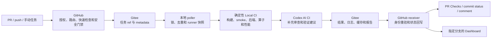
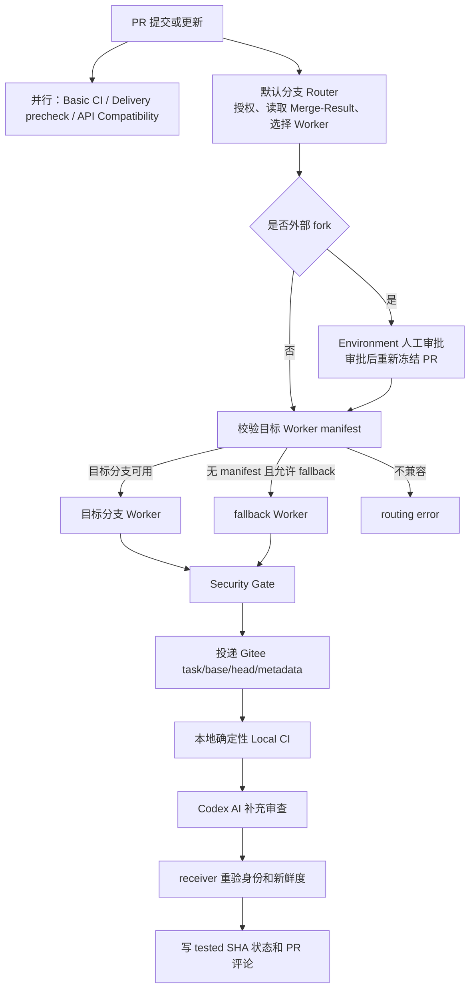

# triton-anchor CI 说明（重构版）

多分支 Gateway、Local CI 与 AI 辅助审查说明

## 1. CI 现在做了哪些工作

### 1.1 CI 的目标

triton-anchor 的 CI 不只是运行单元测试，而是覆盖从代码提交到结果回写的完整链路：

1. 在 GitHub 上接收 PR、push 或手动任务；
2. 判断任务是否有权执行、应由哪个分支的 Worker 处理；
3. 先完成快速、通用且不依赖专用硬件环境的检查；
4. 将依赖 LLVM、PPL、目标后端和运行时的重型任务投递到本地服务器；
5. 将本地测试结果、性能数据和 AI 审查结论回写 GitHub；
6. 将指定分支的最新结果同步到 GitHub Pages Dashboard。

软件包发布和版本发布不在本文范围内。

### 1.2 GitHub、Gitee 和本地服务器分别负责什么

CI 由三个执行域协同完成：

| 执行域 | 主要职责 | 不承担的职责 |
| --- | --- | --- |
| GitHub | 接收事件、权限判断、分支路由、快速检查、安全门禁、状态展示、结果接收和 Pages 部署 | 不直接运行依赖完整后端环境的重型测试，不直接连接本地服务器 |
| Gitee 中转仓库 | 保存待执行任务 ref、任务元数据、本地测试结果、性能缓存和 Dashboard 数据 | 不决定 PR 是否授权，不执行测试 |
| 本地服务器与 Docker | 轮询任务、固定可信 runner、构建前后端、执行 smoke/JIT、FlagGems、性能测试和 Codex AI 审查 | 不决定 GitHub 权限、目标分支策略和合入规则 |

GitHub 与本地服务器之间不建立入站直连。GitHub 将任务写入 Gitee，本地 poller 主动轮询；任务完成后结果仍写入 Gitee，再由 GitHub receiver 读取并回写状态。

### 1.3 当前 CI 能力清单

| CI 工作 | 执行位置 | 触发方式 | 主要目的 |
| --- | --- | --- | --- |
| Router 与 Gateway Contract 校验 | GitHub，默认分支 | PR、维护者手动 push 路由 | 授权任务、选择 Worker、冻结 SHA、拒绝不兼容分支 |
| Basic CI | GitHub-hosted runner | PR 和 push | Ruff、格式检查、Python 3.9 至 3.12 纯 Python 单测、覆盖率 |
| Delivery precheck | GitHub-hosted runner | PR 和 push | 检查 Shell/Python CI 脚本、前端及性能协议是否可执行 |
| Delivery full smoke | GitHub Docker runner | 手动设置 `run_full_smoke=true` | 验证容器构建环境及 frontend-only、Sophgo CModel、custom profile |
| Public API Compatibility | GitHub-hosted runner | PR 和 push | 检查稳定 Python API 是否发生不兼容变更并生成报告 |
| Security Gate | GitHub，Worker 分支 | Local CI 投递前 | 扫描凭据泄漏、不受控网络访问、危险执行方式并运行 CodeQL |
| Local CI dispatch/receive | GitHub，Worker 分支 | Security Gate 通过后 | 投递 Gitee 任务、写 pending、等待结果、重验身份并回写状态 |
| 前端构建与 smoke | 本地 Docker | PR、Worker push 或手动任务 | 验证 wheel 构建、安装、导入和前端基本功能 |
| 后端 rebuild 与 smoke/JIT | 本地 Docker | PR、Worker push 或手动任务 | 验证目标后端、运行时及 JIT 链路 |
| FlagGems 算子测试 | 本地 Docker | PR/push 默认 sample，手动 full | 验证算子正确性并记录独立算子结果 |
| 性能与编译质量检查 | 本地 Docker | PR、push | 比较 compile-time、Pass profile 和 IR serialization |
| Codex AI CI | 本地服务器 | 确定性 Local CI 之后 | 结合代码差异和测试证据给出补充审查与排查建议 |
| 结果桥接与 Dashboard | GitHub + Gitee | Local CI 完成后 | 回写 commit status、PR 评论并部署指定分支的状态页面 |
| Worker 健康监测 | 本地服务器 + Gitee | systemd timer | 发布 poller、活动任务、容器和存储快照，供 Dashboard 按需读取 |
| 本地资源与保留治理 | 本地服务器 | 每轮任务及每日维护 | 限制任务时长、日志和 artifact，并回收过期受管数据 |

### 1.4 为什么有些工作在 GitHub 执行，有些必须在本地执行

GitHub 适合执行以下任务：

- 运行时间短、依赖通用、可以快速反馈；
- 不需要目标后端、专用运行时或长期保存的性能基线；
- 与 GitHub 权限、PR 身份、分支保护和状态展示直接相关；
- 需要在使用写凭据前完成可信安全检查。

本地服务器适合执行以下任务：

- 依赖 LLVM、PPL、目标后端、预置数据和专用容器；
- 构建时间长、资源消耗大，或需要复用硬件和缓存；
- 需要连续保存性能基线、失败 IR、算子结果和历史产物；
- 需要使用受控的 CI 专用凭据和 Codex AI 运行环境。

这种拆分让 GitHub 先快速发现常见问题，本地环境再验证完整编译和后端链路，避免每次 PR 都在 GitHub runner 中重建复杂工具链。

### 1.5 总体流程



GitHub 上的 Basic CI、Delivery precheck 和 API Compatibility 与 Local CI 主链可以并行运行。它们分别给出快速检查结果，不需要等待本地任务完成。

## 2. PR 提交后会经历哪些 CI 流程

### 2.1 PR 触发后的两条并行链路

一个 PR 提交到 `master` 或其他目标分支后，会同时形成两类检查：

1. **分支自有的 GitHub CI**：运行目标分支中定义的 Basic CI、Delivery precheck 和 API Compatibility；
2. **Gateway + Local CI**：由默认分支 Router 进行授权和路由，再交给目标 Worker 或 fallback Worker 完成安全检查、本地测试和结果回写。

第一类检查解决“代码本身是否通过快速通用检查”；第二类检查解决“代码合并到目标分支后，是否能在真实编译和后端环境中工作”。

### 2.2 PR 目标分支如何影响 Worker 选择

默认分支是统一 Router 入口。无论 PR 的目标是 `master` 还是其他分支，授权和 Worker 选择都由默认分支中的可信 Router 完成；Router 不 checkout PR 代码，也不读取 `GITEE_TOKEN`。

| PR 场景 | Router 的处理 | 实际执行 Local CI 的 Worker |
| --- | --- | --- |
| PR 提交到默认分支 `master` | 默认分支只负责路由和授权，不直接执行候选代码 | 按配置选择专用/fallback Worker |
| PR 提交到带兼容 manifest 的其他分支 | 校验目标分支 manifest 和 Gateway Contract，并冻结 Worker revision | 目标分支自己的 Worker |
| PR 提交到没有 manifest 的其他分支 | 在 `LOCAL_CI_FALLBACK_PR_ENABLED=true` 时进行代管 | `LOCAL_CI_FALLBACK_WORKER_BRANCH` 指定的 fallback Worker |
| 目标分支 manifest 损坏、版本不兼容或能力不足 | 拒绝路由并写诊断状态 | 不投递 Local CI，等待分支维护者修复 |
| 外部 fork PR | 先进入 `local-ci-fork-approval` Environment；审批后重新读取当前 PR | 审批通过后再按上述规则选择 Worker |

这里的关键区别不是“master 是否测试”，而是“谁提供可信 Worker”。PR 的候选代码始终作为被测对象，不会替换 Router、scanner、dispatcher 或本地 supervisor。

### 2.3 一个 PR 的完整处理步骤

#### 步骤 1：GitHub 接收 PR 事件

Router 读取 PR 的目标分支、贡献者 head、GitHub 生成的 Merge-Result 和 PR 生命周期状态。

PR Local CI 测试的不是单独的贡献者 head，而是：

```text
refs/pull/<PR号>/merge
```

该 Merge-Result 表示“当前 PR 合并到目标分支后的结果”。其中第一父提交作为 `comparison_base_sha`，第二父提交对应贡献者 head，Merge-Result 自身作为 `tested_sha`。

#### 步骤 2：快速 GitHub CI 并行运行

目标分支中持有的 GitHub workflow 通常并行执行：

- Ruff 和格式检查；
- Python 3.9、3.10、3.11、3.12 纯 Python 单测；
- CI 脚本语法、导入和协议预检；
- 稳定 Python Public API 兼容性检查。

这些任务失败时会直接显示在 PR Checks 中，不需要等待 Local CI。

#### 步骤 3：Router 授权并选择 Worker

Router 完成以下工作：

- 判断 PR 是否来自同仓库或外部 fork；
- 对外部 fork 等待 Environment 审批；
- 读取目标分支 Worker manifest；
- 校验 `gateway_contract_version` 和所需能力；
- 冻结 `expected_head_sha`、`comparison_base_sha`、`tested_sha` 和 `worker_revision_sha`；
- 取消或标记已经过期的同 PR 旧任务。

#### 步骤 4：Worker 执行 Security Gate

被选中的 Worker 使用被冻结的可信版本运行 scanner 和 CodeQL。Security Gate 在任何 Gitee 写凭据进入执行链之前完成，用于发现：

- 凭据泄漏或将 token 写入日志；
- 不受控的网络访问；
- 危险命令拼接或执行方式；
- 可能突破既定 CI 边界的 workflow/脚本改动。

Security Gate 通过后才允许 dispatcher 投递任务。

#### 步骤 5：Dispatcher 写入 Gitee 任务

Dispatcher 将以下信息写入 Gitee：

- PR task ref：指向待测试的 Merge-Result；
- base ref：提供可信基线和性能比较来源；
- head ref：提供贡献者精确提交；
- metadata：保存 PR 标题、描述以及 base/head/tested SHA；
- GitHub pending status：表示 Local CI 已进入等待或执行状态。

#### 步骤 6：本地 poller 执行确定性 Local CI

本地 poller 主动扫描允许的 `ci/*` ref，完成锁、去重、runner 快照和任务目录准备，并根据可信提交声明的 LLVM 版本标识选择本地服务器维护的版本 profile；无法匹配时明确失败。普通代码任务按固定顺序在选定容器中执行：

```text
精确 checkout tested SHA
  -> 获取性能 baseline
  -> 激活 Python 环境
  -> 前端 build / wheel install / import verify
  -> 前端 smoke
  -> 后端环境 / rebuild / discovery
  -> 后端 smoke + JIT
  -> FlagGems sample
  -> compile-time / Pass profile / IR serialization
  -> 生成 summary 和 result.json
```

所有 profile 都要求前端 build 和前端 smoke；后端阶段由 profile 的 `RUN_BACKEND_STAGES` 控制，frontend-only profile 将其记录为 `skipped`。docs-only PR 使用 `codex_only` 模式，不运行确定性构建。

#### 步骤 7：Codex AI 进行补充审查

确定性 Local CI 完成后，Codex AI 读取被冻结的代码差异、PR 描述、阶段日志和失败产物，生成补充审查、风险说明和后续验证建议。AI 不改变必选阶段的退出码和门禁结论。

#### 步骤 8：Receiver 回写最终结果

本地结果先发布到 Gitee `local-ci-results`。GitHub receiver 读取结果后再次确认：

- PR 是否仍然打开且不是过期任务；
- head、Merge-Result、tested SHA 和 run ID 是否仍匹配；
- 结果是否来自预期的 Worker revision 和任务目录；
- 状态是否应写到当前 Merge-Result。

确认通过后，receiver 将最终 `success`、`failure` 或 `error` 写到 `tested_sha`，并发布 Codex 评论和相关结果链接。

### 2.4 PR 流程图



### 2.5 PR 更新、force-push 和目标分支变化

同一个 PR 更新后会产生新的 head、Merge-Result 和 tested SHA。系统按以下规则处理旧任务：

- 新提交会更新对应 task ref，并形成新的 run；
- Router/Worker 尝试取消或淘汰旧 receiver 和过期任务；
- receiver 回写前再次检查 SHA，新鲜度不匹配时拒绝写回；
- PR 改目标分支、关闭或转为 draft 后，旧任务不能更新当前状态；
- 外部 fork 提交新 commit 后，需要按当前 Environment 策略重新审批；
- Actions 和 Gitee 结果目录保留历史记录，但 PR Checks 只显示当前 tested SHA 的状态。

### 2.6 push 和手动任务

PR 之外还支持以下入口：

| 场景 | 处理方式 |
| --- | --- |
| 自持 Worker 分支 push | 写入 `ci/push/<branch>`，测试该分支的精确 push SHA |
| 无 Worker 分支 push | 具有 `write`、`maintain` 或 `admin` 权限的维护者从默认分支 Gateway 手动选择 `mode=push` |
| 手动完整 FlagGems | 写入 `ci/full/<branch>`，运行完整算子集合 |
| 手动 Delivery full smoke | 在 GitHub Docker runner 中运行，不经过本地 poller |

跨分支 fallback push 只回写真实 source branch commit 的状态，不刷新生产 Dashboard。

## 3. AI 在 CI 中扮演什么角色

### 3.1 AI 的位置

Codex AI 位于确定性 Local CI 之后。它使用已经产生的测试证据进行补充审查，而不是在测试之前猜测代码是否正确。

确定性 CI 负责回答：

- 代码是否构建成功；
- 必选 smoke/JIT 是否通过；
- 算子测试是否通过；
- 性能和编译质量是否出现可量化变化；
- 最终退出码是什么。

Codex AI 负责回答：

- 贡献者想解决什么问题；
- 实际代码改动是否覆盖了该目标；
- 失败更可能位于哪个阶段或文件；
- 哪些风险没有被现有测试覆盖；
- 下一步应补充什么验证。

### 3.2 AI 使用的输入和生成的输出

PR 任务会冻结以下输入：

- PR title 和 description；
- base、head 和 tested SHA；
- base 到 head 的代码差异；
- Merge-Result 对应的确定性 CI 日志；
- 构建、后端、FlagGems 和性能摘要；
- 本次任务产生的 failure IR 和其他失败产物。

AI 通常生成：

- 审查摘要和合入建议；
- 目标、预期效果和当前实现情况；
- 需要处理的问题，以及可信时对应的文件和行；
- 已完成验证和未覆盖范围；
- 失败定位与后续验证建议；
- 本次改动文件及影响概览。

完整报告保存在 Local CI 结果中，GitHub PR 上显示 Codex 评论和 advisory 状态。同一 tested SHA 重跑时可更新对应评论；新的 tested SHA 保留新的审查记录。

### 3.3 与传统 CI 的区别

| 对比项 | 传统确定性 CI | Codex AI CI |
| --- | --- | --- |
| 判断依据 | 固定命令、断言、阈值和退出码 | 代码语义、PR 意图、差异、日志和测试证据 |
| 输出 | 通过/失败、阶段状态、日志和指标 | 风险解释、问题归纳、验证缺口和排查建议 |
| 可重复性 | 输入和环境相同则结果应稳定 | 结论具有辅助性，不作为唯一门禁 |
| 适用问题 | 已知规则、回归测试、构建和性能阈值 | 跨文件影响、语义风险、测试覆盖不足和复杂失败解释 |
| 合入门禁 | 是，必选阶段决定最终状态 | 否，当前定位为 advisory |

AI 驱动并不意味着用 AI 替代测试。当前设计是“确定性 CI 给出事实，AI 基于事实补充理解”，从而适应快速迭代或 vibe coding 场景中代码变化快、人工审查压力大的情况。

### 3.4 AI 的边界

- 确定性 Local CI 失败时，AI 可以帮助定位，但不能将失败改为成功；
- AI 不可用、超时或报告生成失败时，必选阶段的门禁结论仍有效；
- `RUN_CODEX_AI_CI=true` 时启用 AI 审查链路；
- AI 使用独立的 `CODEX_AI_CI_HOME` 和 CI 专用 token，不复用开发者个人配置；
- AI 临时工作区与确定性 runner 分离，报告和证据随任务结果一起保存；
- 本地服务器仍是受信任的 CI 环境，不能把 AI 或 Docker 当成可执行任意恶意代码的绝对安全沙箱。

## 4. 安全性和抗挤兑设计

### 4.1 主要安全目标

CI 需要同时防范以下风险：

1. PR 中的候选代码修改 CI 控制逻辑并窃取凭据；
2. 外部 fork 未经授权占用本地后端和算力资源；
3. force-push、改目标分支或旧任务回写错误状态；
4. 伪造 Gitee 结果或将结果写到错误的 GitHub SHA；
5. 大量 PR、重复更新或手动任务挤占队列、磁盘和本地服务器；
6. AI token、Gitee token 或其他凭据进入候选代码执行环境。

### 4.2 已实现的安全边界

#### 可信 Router 与 Worker

- Router 始终使用默认分支的可信代码；
- Router 不 checkout PR 内容，也不读取 `GITEE_TOKEN`；
- Worker revision 在投递前冻结，scanner、dispatcher 和 receiver 使用同一个精确版本；
- Gateway Contract 和 manifest 版本不匹配时直接拒绝执行。

#### 外部 fork 审批

- 外部 fork 进入 `local-ci-fork-approval` Environment；
- 配置 Required reviewers 后，维护者审批才会继续；
- 审批后重新读取当前 head 和 Merge-Result，防止审批对象发生变化；
- 新 commit 重新进入当前审批流程。

注意：仅创建 Environment 但不配置 Required reviewers，不构成人工门禁，GitHub 可能自动继续。

#### 凭据最小化

- Security Gate 在 Gitee 写凭据使用前运行；
- Router 不接触 Gitee 写 token；
- `LOCAL_CI_ALLOW_WRITE_TOKEN_IN_CONTAINER=0` 时，不把写 token 传入候选容器；
- 必须传入容器的 relay token 应使用最小权限；
- Codex AI 使用专用 CI token，不复制个人配置；
- 真实 token 只保存在 GitHub Secrets 或本地服务器的真实配置中。

#### 精确身份与结果重验

- 任务冻结 head、base、tested SHA、Worker revision 和 run ID；
- PR 实际测试 Merge-Result，状态写到同一个 tested SHA；
- receiver 在回写前重验 PR 状态、SHA、新鲜度和结果身份；
- PR 关闭、改目标分支、force-push 或产生新 Merge-Result 后，旧结果不能覆盖当前状态。

#### 本地执行边界

- poller 只识别允许的 `ci/pr-*`、`ci/push/*` 和 `ci/full/*` 任务 ref；
- `ci/base/*`、`ci/head/*`、`ci/meta/*` 和结果分支不会被当成执行任务；
- poller 从 `LOCAL_CI_SCRIPT_DIR` 复制可信 runner 快照，PR 中的脚本不直接作为 supervisor；
- 每个任务使用独立日志、runner 快照和带 ownership marker 的临时目录；
- failure IR 只收集本次失败命令产生的文件，不清理全局缓存。

### 4.3 当前用于防止任务挤兑的机制

现有设计已经具备以下基础保护：

| 机制 | 作用 |
| --- | --- |
| 外部 fork 人工审批 | 阻止未授权外部 PR 自动消耗本地资源 |
| 维护者权限限制 | 无 Worker 分支的跨分支 push 只能由具有相应仓库权限的维护者手动发起 |
| PR task ref 固定命名 | 同一 PR/来源分支的新任务更新对应 ref，避免无限创建同类活动入口 |
| 过期任务取消和新鲜度检查 | PR 更新后淘汰旧 receiver，旧结果不能回写当前状态 |
| poller 锁与去重 | 防止同一任务被多个轮询周期重复执行 |
| ref 白名单 | base、head、metadata、结果分支和任意未知 ref 不会触发执行 |
| full 任务手动触发 | 完整 FlagGems 和 full smoke 不作为每次 PR 的默认重型任务 |
| sample 与 baseline 分层 | 常规 PR 运行 sample；性能 baseline 可复用并按 SHA/profile 隔离 |
| metadata 长度限制 | PR title 最多 500 字符，description 最多 8000 字符，防止异常元数据无限膨胀 |

这些机制能够抑制重复执行、旧任务回写和未授权外部任务，但对“大量不同 PR 同时涌入”的场景，仍需要部署侧的容量控制。

### 4.4 建议补强的队列和资源保护

当前文档和流程中没有把全局队列上限、单用户速率限制和资源熔断定义为完整协议。生产部署建议补充以下措施，并将其作为后续 CI 治理工作：

1. **限制并发数**：按后端 profile 设置本地最大并发，重型后端默认串行或小并发运行；
2. **设置有界队列**：限制 pending 任务总数，超过上限时停止 dispatch 或返回明确的 `queued/throttled` 状态；
3. **按 PR 合并任务**：同一 PR 只保留最新 tested SHA，旧 SHA 在进入容器前直接丢弃；
4. **按账号和来源限流**：对外部贡献者、同一 fork 或同一时间窗口设置任务配额；
5. **队列 TTL**：长时间未开始、PR 已关闭或 SHA 已过期的任务自动回收；
6. **资源配额**：限制单任务 CPU、内存、磁盘、运行时间、日志大小和 artifact 大小；
7. **熔断和降级**：磁盘、Gitee、后端或结果发布异常时暂停接收新任务，保留 Basic CI 等 GitHub 快速检查；
8. **监控与告警**：监控队列长度、等待时间、失败率、磁盘、容器和 token 错误；
9. **保留策略**：按时间和数量清理旧 workspace、runner 快照、日志和非关键 artifact；
10. **保护手动重型入口**：`ci/full/*`、full smoke 和跨分支 fallback push 仅向维护者开放。

推荐的处理顺序是：先在 Router/dispatcher 处做授权和限流，再在 poller 处做有界队列、并发控制和过期回收，最后由容器运行时执行资源上限。只在本地服务器末端限流，仍会造成 Gitee task ref 和 GitHub receiver 的堆积。

### 4.5 安全配置检查表

- `local-ci-fork-approval` 已配置 Required reviewers；
- `LOCAL_CI_ALLOW_WRITE_TOKEN_IN_CONTAINER=0`，或使用最小权限 relay token；
- `GITEE_TOKEN` 只对 Worker workflow 可见，Router 不读取；
- `CODEX_AI_CI_HOME` 使用专用 CI 账号和 token；
- `GITEE_BRANCH_INCLUDE_REGEX` 只包含允许执行的任务 ref；
- `LOCAL_CI_PAGES_BRANCH` 与 `github-pages` Environment 的允许分支一致；
- GitHub Variables 未残留旧 owner、结果仓库或旧 Worker 分支；
- poller、可信脚本和配置更新后已重启；
- 本地服务设置了并发、超时、磁盘和日志上限；
- 对异常队列长度和重复失败配置了告警。

## 5. 其他实现与运维细节

### 5.1 Gitee 任务 ref 和结果目录

| 类型 | Gitee ref | poller 是否执行 | 用途 |
| --- | --- | --- | --- |
| PR task | `ci/pr-<PR号>/<source-branch>` | 是 | 指向 GitHub Merge-Result |
| PR base | `ci/base/pr-<PR号>/<source-branch>` | 否 | 性能基线和可信 base |
| PR head | `ci/head/pr-<PR号>/<source-branch>` | 否 | 贡献者精确 head 和 Codex diff |
| PR metadata | `ci/meta/pr-<PR号>/<source-branch>` | 否 | 保存 `task-metadata.json` |
| push | `ci/push/<branch>` | 是 | 测试精确 push SHA |
| full | `ci/full/<branch>` | 是 | 手动完整 FlagGems |
| 结果 | `local-ci-results` | 否 | 结果、日志、性能缓存和 Dashboard 数据 |

结果目录由 `scripts/local_ci/shared/result_paths.py` 统一生成：

```text
runs/ci_push/ci_push_<branch>/<sha>/<run-id>/
runs/ci_pr/ci_pr-<number>_<branch>/h-<head12>_m-<merge12>/<run-id>/
runs/ci_pr/ci_base_pr-<number>_<branch>/<sha>/<run-id>/
runs/ci_full/ci_full_<branch>/<sha>/<run-id>/
```

### 5.2 FlagGems 和性能基线

- 常规 PR/push 可运行 FlagGems sample；
- 手动 `ci/full/*` 运行完整算子集合；
- 每个 operator 在独立进程中执行并保存状态、失败阶段和耗时；
- PR 性能比较使用 exact base SHA 的 compile-time、Pass profile 和 IR serialization cache；
- 三类 cache 同时缺失时，poller 可先运行 base task 预热；
- base task 不重复运行 FlagGems sample，失败也不阻断 candidate，但 candidate 会记录缺少基线的 warning；
- cache 按 `<sha>/<backend-profile>` 隔离。

当前完成端到端验证的 backend profile 是 **Sophgo CModel**。其他后端仍需要各自的容器、测试命令、性能基线和页面数据，不能直接视为已经达到同等验证状态。

### 5.3 GitHub 状态语义

正常 PR 的主状态写入 `tested_sha`，即 Merge-Result SHA。PR head 只用于授权、Codex diff 和过期检查。

| 状态 | 含义 |
| --- | --- |
| `pending` | 任务已投递，本地 CI 尚未发布最终结果 |
| `success` | 必选阶段通过；可能仍有性能 warning |
| `failure` | 构建、smoke/JIT、FlagGems 或 benchmark 执行失败 |
| `error` | 路由、dispatch、receiver、凭据、结果协议或等待超时异常 |

当 merge conflict 或早期路由失败导致没有可用 Merge-Result 时，Gateway 才在 PR head 写 `<context>/routing` 诊断状态。

### 5.4 Dashboard

Dashboard 从 Gitee `local-ci-results` 同步最新有效结果，从 Worker 健康状态仓库读取健康快照，并由指定 Pages 来源分支部署。页面主要展示：

1. 最近一次手动 full FlagGems 算子结果；
2. 指定分支的后端健康状态；
3. 编译时间、Pass profile 和 IR serialization 摘要；
4. 本地服务器上的 Worker 运行状态；
5. 搜索、筛选、失败阶段查看和 CSV/Excel 导出。

数据模式包括：

- `mock`：仓库演示数据；
- `mixed`：后端和性能已同步，但没有有效 full 结果；
- `live`：full、后端状态和性能均来自实际 Local CI。

只有 `LOCAL_CI_PAGES_BRANCH` 的 push 或 full 结果可以部署生产页面。跨分支 fallback push 不刷新 Dashboard。

### 5.5 主要 workflow 和模块入口

| 功能 | 文件或目录 |
| --- | --- |
| Router/Worker Gateway | `.github/workflows/ci-gateway.yml` |
| Worker 能力声明 | `.github/ci-gateway-manifest.json` |
| Basic CI | `.github/workflows/ci_basic.yml` |
| Delivery CI | `.github/workflows/delivery-ci.yml` |
| Public API Compatibility | `.github/workflows/api-compat.yml` |
| API Breaking Notification | `.github/workflows/api-breaking-notify.yml` |
| Security Gate | `.github/workflows/security-gate.yml` |
| Local CI 投递 | `.github/workflows/dispatch-local-ci.yml` |
| Local CI 结果接收 | `.github/workflows/receive-local-ci-result.yml` |
| Dashboard/Pages | `.github/workflows/backend-status-pages.yml` |
| Local CI contract 手动预检 | `.github/workflows/local_ci.yml` |
| 本地 poller | `scripts/local_ci/poll_gitee_and_run.sh` |
| 容器编排 | `scripts/local_ci/orchestration/` |
| 确定性 runner | `scripts/local_ci/deterministic_ci/` |
| Codex AI | `scripts/local_ci/codex_ai/` |
| 结果发布与 bridge | `scripts/local_ci/results/` |
| 共享协议 | `scripts/local_ci/shared/` |

### 5.6 关键配置

GitHub 侧：

| 类型 | 配置 | 作用 |
| --- | --- | --- |
| Secret | `GITEE_TOKEN` | Worker 写任务、receiver/Pages 读结果 |
| Secret | `PREBUILT_DOWNLOAD_TOKEN` | 手动 full smoke 下载私有预构建依赖 |
| Variable | `GITEE_RESULTS_OWNER` / `GITEE_RESULTS_REPO` | 结果仓库 owner 和名称 |
| Variable | `GITEE_USERNAME` | token 对应的认证账号 |
| Variable | `LOCAL_CI_FALLBACK_WORKER_BRANCH` | fallback Worker 分支 |
| Variable | `LOCAL_CI_FALLBACK_PR_ENABLED` | 是否代管无 manifest PR |
| Variable | `LOCAL_CI_FALLBACK_PUSH_ENABLED` | 是否允许维护者手动代管 push |
| Variable | `LOCAL_CI_PAGES_BRANCH` | 唯一生产 Dashboard 来源分支 |
| Variable | `DASHBOARD_SOURCE_BRANCH` / `DASHBOARD_FULL_TEST_SOURCE_BRANCH` | Dashboard 读取的 push/full 任务来源 |
| Environment | `local-ci-fork-approval` | 外部 fork 审批 |
| Environment | `github-pages` | Pages 部署边界 |

本地服务器从模板创建真实配置：

```bash
cp scripts/local_ci/config.example.env /home/localci/local_ci/config.env
```

典型启动方式：

```bash
LOCAL_CI_CONFIG=/home/localci/local_ci/config.env \
  bash scripts/local_ci/poll_gitee_and_run.sh --once
```

持续运行时应使用 systemd 或其他进程管理器，以便开机启动、失败重启和集中查看日志。

### 5.7 常见排查顺序

1. 查看 GitHub Actions，确认问题发生在 Router、Basic CI、Security Gate、dispatcher、receiver、Pages 还是 API Compatibility；
2. Local CI 长时间 `pending` 时，检查 Gitee 对应 `ci/*` task ref 和 SHA；
3. 检查 poller 是否运行，以及 `LOCAL_CI_STATE_DIR` 中的 lock、runner 快照和任务日志；
4. 检查本地容器、workspace、Python venv、LLVM、PPL 和 backend 路径；
5. 在 `local-ci-results` 中按 PR 的 head/Merge-Result 或 push SHA 查找 `latest.txt`、manifest、summary 和 result；
6. 按阶段查看前端、后端、FlagGems、性能和 Codex 产物；
7. Pages 未更新时，检查 receiver 是否请求 `mode=pages`，并核对 Pages branch、Environment 和 Dashboard source refs。

### 5.8 修改 CI 时的最低验证集

修改 Local CI、结果协议、Codex AI 或 Gateway 后，至少在 Linux 环境执行：

```bash
bash -n scripts/local_ci/poll_gitee_and_run.sh
python -m compileall -q scripts/local_ci

python -m pytest \
  scripts/local_ci/codex_ai/tests \
  scripts/local_ci/tests/test_module_layout.py \
  scripts/local_ci/results/tests \
  -v --tb=short

PYTHONPATH=python:scripts/local_ci python -m pytest \
  python/triton_anchor/tests/test_dashboard_contract.py \
  python/triton_anchor/tests/test_dashboard_sync.py \
  python/triton_anchor/tests/test_compile_time_regression.py \
  python/triton_anchor/tests/test_pass_profile_regression.py \
  python/triton_anchor/tests/test_ir_serialization_regression.py \
  -v --tb=short

git diff --check
```

涉及 Docker、symlink、`/tmp`、容器权限或编码差异时，还需要在 Linux/Docker 环境验证。无法执行的检查应在提交说明中记录原因、风险和替代验证，不能直接省略必选检查。

## 6. 总结

triton-anchor CI 的核心逻辑可以归纳为：

1. GitHub 负责事件、权限、路由、快速检查、安全门禁和结果展示；
2. Gitee 负责隔离 GitHub 与本地服务器之间的任务和结果传递；
3. 本地服务器负责真实编译、后端、算子和性能验证；
4. PR 测试当前 Merge-Result，并通过 SHA 冻结和 receiver 重验避免旧结果误写；
5. Codex AI 在确定性 CI 之后解释改动、风险和验证缺口，不替代传统门禁；
6. 当前已有审批、去重、锁和过期检查等基础防护，生产部署仍应补充有界队列、并发限制、配额和熔断机制。
