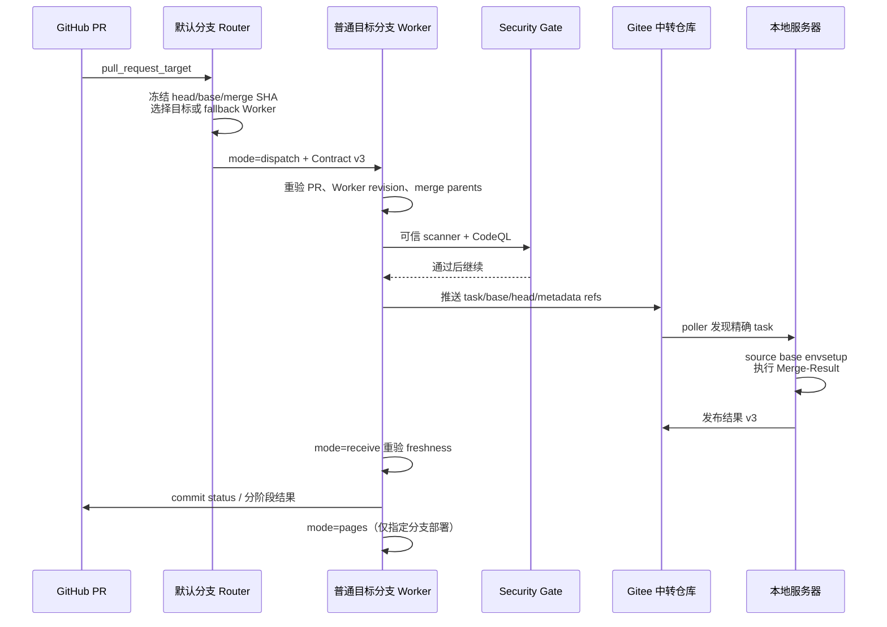

# 多分支 CI Gateway v3 架构与责任边界
<!-- fork PR smoke-test touch. -->

## 目标
本文档说明多分支CI架构与责任边界，仅作说明，不执行代码
多分支 CI 允许不同开发者维护各自普通目标分支的 CI 微调，同时由默认分支提供稳定入口。统一 Gateway Contract 约束调用接口和安全边界，避免某个分支自行改变 inputs、SHA 语义或 secret 使用方式。

## 分支职责

| 位置 | 主要职责 | 不负责 |
| --- | --- | --- |
| 默认分支 | PR 事件入口、同仓自动授权、外部 fork 人工授权、Worker 发现、状态初始化、生命周期取消路由 | 不读取 Gitee secret，不 checkout/执行候选代码，不持有 scanner 和本地执行 workflow |
| 普通目标分支 | Worker manifest、Security Gate、dispatcher、receiver、Pages、普通 GitHub CI 和本地 runner | 不修改默认分支授权规则，不绕过 Contract 直接接收外部 fork |
| fallback Worker 分支 | 临时代管没有 manifest 的目标分支 PR，以及维护者手动请求的跨分支 push | 不替代目标分支普通 GitHub CI，不为跨分支结果部署 Dashboard |
| Gitee 中转仓库 | 保存 task/base/head/metadata refs 和本地运行结果 | 不负责 GitHub 授权和代码评审 |
| 本地服务器 | 可信 runner 快照、Docker 执行、结果发布 | 不决定 PR 是否获得授权 |

## 文件与职责

| 文件或目录 | 默认分支职责 | 普通目标分支职责 |
| --- | --- | --- |
| `.github/workflows/ci-gateway.yml` | router-only Gateway：授权、Worker 发现、生命周期处理、状态初始化与跨分支调度 | worker-capable Gateway：保留同一公共 Router，并实现 `dispatch`、`push`、`receive`、`pages`、`cancel` |
| `.github/workflows/api-breaking-notify.yml` | 消费 Public API Compatibility 结果并通知或恢复已有评论 | 可以保留副本，但系统只依赖默认分支监听器 |
| `.github/ci-gateway-manifest.json` | 不持有，只读取普通分支 manifest | 声明 Contract v3、Worker 角色、Merge-Result 和实际 capabilities |
| `.github/workflows/security-gate.yml` | 不持有、不执行候选代码扫描 | 使用精确 Worker revision 的 scanner 与 CodeQL 阻止不可信 dispatch |
| `.github/workflows/dispatch-local-ci.yml` | 不持有 | 创建 Gitee task/base/head/metadata refs，写 pending 并启动 receiver |
| `.github/workflows/receive-local-ci-result.yml` | 不持有 | 等待结果、校验 PR 新鲜度、写回 Merge-Result status，并按策略请求 Pages |
| `.github/workflows/backend-status-pages.yml` | 不持有 | 同步结果、验证 Dashboard；只有配置分支可以部署 |
| `.github/workflows/ci.yml`、`delivery-ci.yml`、`api-compat.yml` | router-only 形态不依赖 | 分支自有 GitHub CI，可随目标分支独立调整 |
| `scripts/ci/`、`scripts/local_ci/`、`scripts/dashboard/` | 不持有 scanner、runner 或页面实现 | 提供可信扫描、本地执行、结果发布和页面数据转换 |

普通目标分支启用自身 Worker 时，manifest、Gateway、Security Gate、dispatcher、receiver、Pages workflow 及其必要脚本必须成套存在。缺少 manifest 才允许 fallback；manifest 已存在但损坏或能力不足时明确失败。

## Gateway Contract v3

Contract 嵌入两侧的 `.github/workflows/ci-gateway.yml`。Router 与 Worker 必须保持相同事件、`workflow_dispatch.inputs`、公共路由 jobs 和版本号；Worker 是 Router 公共逻辑的严格超集。

固定 mode：

- `dispatch`：路由并投递 PR Merge-Result。
- `push`：维护者让 fallback Worker 代跑无 Worker 分支的精确 head。
- `receive`：继续等待结果，并在回写前重新校验任务新鲜度。
- `pages`：验证或部署 Dashboard；只有配置分支可以部署。
- `cancel`：停止旧 receiver，并按唯一清理者规则删除 relay refs。

固定 SHA 语义：

| 字段 | 含义 |
| --- | --- |
| `expected_head_sha` | 获得授权的 PR head；只用于权限绑定、force-push 和新鲜度校验 |
| `comparison_base_sha` | 冻结的 PR base；性能比较和可信 envsetup 来源 |
| `tested_sha` | 实际执行提交和 Required status 目标；PR 为 GitHub Merge-Result，push 为分支 head |
| `requested_sha` | 手动 push 的可选防漂移值 |
| `worker_revision_sha` | 执行 Gateway、scanner、dispatcher 和 receiver 的精确 Worker 版本 |

其他固定字段包括 PR 编号、source/target branch、授权来源、task ref、status context、receiver continuation、取消参数和 run title。

## PR 链路



目标分支 manifest 不存在时可回退；manifest 已存在但 JSON 损坏、Contract 不兼容、能力或必要文件缺失时明确失败。外部 fork 自动进入 `local-ci-fork-approval` Environment；配置 Required reviewers 后等待维护者审批，未配置时自动继续。默认分支输入 PR 编号的手动入口保留为备用，所有授权都绑定审批后现场重验的 head 和 Merge-Result SHA。

PR 的 pending、success、failure 和 error Required status 均写入 `tested_sha`。只有尚未得到可用 Merge-Result 的早期路由失败，才在 PR head 写独立的 `${LOCAL_CI_CONTEXT}/routing` 诊断状态。

## 生命周期与结果隔离

- force-push：取消旧的等待审批和 receiver，为新 head 创建新审批；新 dispatcher 覆盖同名 Gitee task ref，避免异步清理误删新任务。旧 receiver 发现 head 或 merge SHA 变化后不再回写。
- retarget：取消旧目标和 fallback Worker 的等待任务，再按新目标重新路由。
- close/draft：取消等待、写 error，并清理未消费的 task/base/head/metadata refs。
- 跨分支 push：只回写真实 source branch commit status，不请求 Pages。
- Pages：所有 Worker 分支可构建验证，只有 `LOCAL_CI_PAGES_BRANCH` 指定分支可部署；生产默认 `CI_dev`。

## 接入新普通分支

1. 从兼容 Worker 版本复制完整 `.github/workflows/ci-gateway.yml` 和必要 worker workflows。
2. 提供 `.github/ci-gateway-manifest.json`，声明 Contract v3、`worker`、`merge-result` 和实际能力。
3. 保持公共 Router jobs 和 inputs 不变，只在 Worker 或普通 CI 实现内部做分支专用调整。
4. 运行 actionlint、契约测试、scanner、Local CI 和 Dashboard 测试。
5. manifest 合入后，默认分支会自动从 fallback 切换到该目标分支自身 Worker。

## 首次 fork 测试变量

测试 integration 分支时只设置仓库变量，不修改生产代码默认值：

```text
LOCAL_CI_FALLBACK_WORKER_BRANCH=integration/ai-ci-gateway-workers-v3
LOCAL_CI_PAGES_BRANCH=integration/ai-ci-gateway-workers-v3
DASHBOARD_SOURCE_BRANCH=ci/push/integration/ai-ci-gateway-workers-v3
DASHBOARD_FULL_TEST_SOURCE_BRANCH=ci/full/integration/ai-ci-gateway-workers-v3
```

生产默认 fallback 和 Pages 分支仍为 `CI_dev`，Gitee owner、仓库、URL、用户名和结果分支继续使用部署环境的现有配置。
