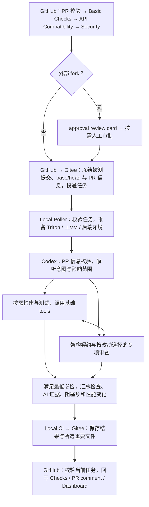

# Local CI

AI 驱动 PR 构建、测试与审查。Codex 负责理解意图、选择验证、组织执行及排错；
Poller 负责准备对应环境、停止失效任务和交付结果。源码和结果都经 Gitee 中转。

## 执行流程



构建、测试和审查按依赖与相关度交错执行。路径分类提供选测建议，Codex 阅读实际 diff，
选择范围、命令与补充用例，并在 `change_validation` 结果中说明影响、选测理由和实际证据。
普通注释和文档可轻量验证；普通 Python 可按需直接验证源码；真实编译器/后端行为变化
仍需相关构建与 smoke/JIT。显式 full 要求全部可用工具对应的覆盖。
Codex 可在任务内修复环境或降低编译并行度重试。
PR 信息与架构审查必须完成，严重高风险发现阻塞；其余风险与有效性能回退报告给维护者。
专项审查按 PR 描述和实际 diff 选择方向，标签仅供参考，无标签也会进行相关审查。
PR 模板是最低信息要求，支持中英文和自定义字段。状态回写与下一检查并行，Basic → API → Security
仍保持成功依赖；外部 fork 在全部前置检查及回写完成后生成审批卡，同仓库任务直接投递。

## 文件结构

```text
scripts/local_ci/
├── AI_CI_PROGRAM.md          # Codex 的职责、工作方式与结果格式
├── agent_ci/                # Poller、原生 Codex CLI、任务身份和 Git 发布
├── prepare/                 # 环境、依赖、任务容器与部署入口
├── maintenance/             # 健康、watchdog 与本地保留清理
├── tools/
│   ├── basic_tools/         # 可复用构建、安装、测试和性能工具
│   ├── ai_review_tools/     # 架构与专项审查说明
│   └── ai_custom_tools/     # 任务内生成工具的使用约定
└── tests/                   # 必要的 Local CI 行为回归
```

GitHub 网关和接收器位于 `scripts/ci/`，页面位于 `dashboard/`。
[AI_CI_PROGRAM.md](AI_CI_PROGRAM.md) 是唯一 Agent 程序入口；[tools/README.md](tools/README.md)
说明调用方法。Codex 原生 shell 可直接运行工具、已有测试及定向脚本，无需 MCP、JUnit 或逐命令回执。
最终以实际结果和必要证据汇总验证范围，不重复执行已有有效验证。先判断是否需要
FlagGems；非 full 最多 6 个不同算子，空 impact 使用固定六个代表样本，超限须显式 full。

## 环境与生命周期

每任务一个 Rootless Docker 容器、一个非 root 用户，Codex 与构建测试共享任务环境。
只读挂载可信控制代码和服务器依赖，源码、venv、编译输出及缓存写入任务目录。
candidate/base 使用冻结提交和独立环境；基线源码已提供，是否构建比较由 Codex 决定。
后端 wheel 在任务内重新构建。`/tmp` 允许动态库加载，编译缓存优先使用 `/task`。

FlagGems 使用服务器 profile 中的固定只读依赖；修改 PR 中的 FlagGems 子模块指针
不会改变该依赖。其他子模块仍通过 Gitee 固定到对应提交。
所有 PR 目标分支都可派发。服务器优先使用 `branch_profiles` 或同名 profile；没有显式选择时，
按被测源码的 LLVM SHA 唯一匹配已配置环境，无需为每个新分支补映射。

Worker 轮询任务有效性，PR 关闭、转 Draft、更换目标或增加提交时停止旧容器。
Codex 短暂中断可恢复同一 CLI 会话；Worker 重启会清理未完成容器并新建任务运行，
保留之前的本地证据。已封存结果只重试发布，不重编、不重测。
Codex 默认最多尝试 10 次（含首次），仍共用任务时间预算；已有配置中的 `codex_attempts` 显式值优先。

```text
state_dir/
├── runs/
│   ├── pr/branch-<目标分支>/pr-<PR号>/<head_sha>/<run_id>/
│   └── push/branch-<目标分支>/<head_sha>/<run_id>/
│       ├── task.json, state.json, codex-session.json
│       ├── logs/            # 本机完整 Codex 日志
│       ├── artifacts/       # 计划、工具输出和定向用例
│       └── sealed/          # 待发布或已发布结果及所选文件；PR 目录内部相同
└── work/<head_sha>/<run_id>/ # 临时任务目录，结束后清理运行目录及空的 SHA 父目录
```

本地运行目录和 Gitee 结果复用同一套事件、目标分支、PR 与源码提交命名。PR 使用
`runs/pr/branch-<目标分支>/pr-<PR号>/<head_sha>/<run_id>/`，push/manual 使用
`runs/push/branch-<目标分支>/<head_sha>/<run_id>/`（分支名中的 `/` 会 URL 编码）。
`head_sha` 使用完整 40 位源码提交号；`task_id` 仍是内部冻结任务摘要，不改变任务协议、
current/cancel 指针和去重规则。同一 SHA 的不同任务用独立 `run_id` 隔离，接收器按结果内的
`task_id` 匹配。`health/worker.json` 在顶层显示活动任务的 `head_sha`（空闲时为 null），
`tasks` 中各项同时保留 `task_id` 和 `head_sha`。
旧的 `<task_id>` 分组目录及 `runs/<task_id>/<run_id>/` 保持原位，重启后仍能去重、恢复
和重试上传，不因目录升级重新执行；新运行使用 SHA 目录。清理 work 不删除 runs 中的证据，
也不删除同一 SHA 下其他运行；清理失败会保留待清理状态而不是报告成功。
本地私有状态与完整日志不上传；仅将 `sealed/` 中的公开结果与所选文件提交到 Gitee 的对应运行目录。
结果提交标题参考 `CI_dev_forPR`，使用 `local-ci: <status> <head_sha前12位> <run_id>`，
其中 status 保留 `pass/fail/infra_error/cancelled` 的真实结果语义；上传重试不产生重复提交。
不使用 Release 附件或额外交付索引。单文件 2 MiB、总计 10 MiB、
最多 20 文件，超出时保留本机并注明；本机完整日志默认保留 30 天。
任务与结果格式只有固定名称，不带版本号；旧格式记录跳过，历史文件不会重新执行。

GitHub 接收器只回写仍对应当前 PR 的结果；任务关闭后终止待定状态，不追加取消评论。
新运行追加中文结果评论，同一结果重试不重复发布；Checks 状态说明使用英文。
Dashboard 展示任务、算子、后端、性能与健康状态。

## 部署与验证

`prepare/config.example.json` 虽保留原名，现为 `jiwang_ci` 的完整非敏感部署配置和唯一维护来源，修改会影响部署。请在开发仓库修改、提交并经 Gitee 部署。服务器 `/home/jiwang_ci/local_ci/config/local-ci.json` 是生成的运行副本，没有本地覆盖 JSON；凭据继续独立保存在 `credentials.env` 与 `codex-source/`。

已有控制 checkout 时，以 `jiwang_ci` 用户运行安装器预览；加 `--apply` 应用，运行配置缺失时也会创建：

```bash
python3 scripts/local_ci/prepare/install.py \
  --config /home/jiwang_ci/local_ci/config/local-ci.json \
  --credentials-env /home/jiwang_ci/local_ci/config/credentials.env
```

空服务器使用[服务器准备](prepare/README.md)中的独立引导脚本和经审核的精确控制提交 SHA 自动创建 checkout，再调用同一正式安装器。安装入口准备环境并启动 Worker、控制仓更新和必要维护定时器；不需要工具服务或独立调度控制台。
详见 [服务器准备](prepare/README.md)、[维护](maintenance/README.md)
与 [GitHub 配置](../ci/README.md)。新 PR 任务使用 `control_policy=worker`，不绑定控制提交；网关记录的 `worker_revision_sha` 仅作来源记录，不参与该类任务 ID，Worker 使用已安装的可信控制代码，并在结果 `environment.control_revision` 记录实际版本。源码 head/base/tested、LLVM 与 PR 信息仍按原规则冻结。旧任务身份保持兼容；push/manual 等固定版本任务要求不同控制版本时，在释放任务锁后将任务身份和 SHA 原子写入单一 `control-update/request.json`，再触发一次 `control-update.service`。多个等待版本按控制仓祖先顺序选择最早的前向提交。更新只允许从配置的 Gitee `control_anchor` 镜像快进到任务指定提交，在同一次 Worker 重启前同步该提交的配置；Worker 检查进程与磁盘版本一致，任务执行期间不会切换控制版本。没有需要更新的新任务时不轮询控制仓，也不定时追随分支最新提交。

安装和更新共用配置同步：按 JSON 结构比较，相同则不写；有差异时先校验，再原子替换，保持 CI 用户所有和 600 权限。`control_update.py --config <运行配置> --expected-revision <40位SHA>` 默认预览，加 `--apply` 应用，也可用当前同一 SHA 修复配置偏差。首次经旧更新器到达新提交后，用新脚本对当前 SHA 执行一次 `--apply` 完成迁移。修改 `control_root`、`state_dir`、`python_bin` 或 `runtime` 等宿主部署锚点需要重新运行安装器。具体命令见[服务器准备](prepare/README.md)。

本地行为回归：

```bash
python3 -m pytest scripts/local_ci/tests -q
```

需要 Python 3.10+、pytest、PyYAML 和 Git；页面测试还需要 Node.js。
这些检查验证控制逻辑，实际环境仍需在服务器完成 build/install/smoke/JIT 与性能验收。
