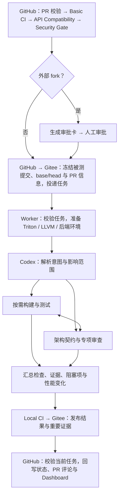

# Local CI

AI 驱动 PR 构建、测试与审查。Codex 负责理解意图、选择验证、组织执行及排错；
Worker 负责准备环境、维护任务状态、停止失效任务和交付结果。源码和结果经 Gitee 中转。

## 执行流程



构建、测试和审查按依赖与相关度交错执行。路径分类提供选测建议，Codex 阅读实际 diff，
选择范围、命令与补充用例，并在 `change_validation` 中说明影响、选测理由和实际证据。
文档和普通注释可轻量验证；可独立运行的 Python 可直接验证源码；
编译器、运行时和后端行为变化需要相关构建与 smoke/JIT。显式 full 要求全部可用工具对应的覆盖。

所有任务都须完成架构审查与实际变更验证。PR 任务另需校验 PR 信息，最低要求为概述、
范围和验证情况，支持中英文及自定义字段；push/manual 任务的 `pr_info` 为
`not_applicable`。专项审查按描述和实际 diff 选择，标签仅供参考。
严重高风险发现阻塞，其余风险与有效性能回退报告给维护者。

验证优先复用已有有效结果。需要 FlagGems 时，非 full 最多选择 6 个不同算子，
空 impact 使用固定六个代表样本，扩大范围须显式 full。具体执行约定见
[AI_CI_PROGRAM.md](AI_CI_PROGRAM.md) 和 [工具文档](tools/README.md)。

## 文件结构

```text
scripts/local_ci/
├── AI_CI_PROGRAM.md          # Agent 职责、工作方式与结果格式
├── agent_ci/                # Worker、Codex CLI、任务身份和结果发布
├── prepare/                 # 环境、依赖、任务容器与部署
├── maintenance/             # 健康采集、恢复、外部告警与保留清理
├── tools/
│   ├── basic_tools/         # 构建、安装、测试和性能工具
│   ├── ai_review_tools/     # 架构与专项审查说明
│   └── ai_custom_tools/     # 任务内辅助工具约定
└── tests/                   # Local CI 行为回归
```

GitHub 网关和接收器位于 `scripts/ci/`，页面位于 `dashboard/`。
[AI_CI_PROGRAM.md](AI_CI_PROGRAM.md) 是 Agent 的程序入口。

## 环境与生命周期

### 环境选择

网关冻结 base 与 candidate 各自源码声明的 Triton 版本和 LLVM SHA；
服务器校验源码后，用 **Triton major.minor + 完整 LLVM SHA** 唯一选择可信 profile。
所有 PR 目标分支都可派发，两侧均需有匹配环境。

| 内容 | 规则 |
| --- | --- |
| 镜像与容器 | 所有 profile 使用同一固定镜像；每任务一个 Rootless Docker 容器、一个非 root 执行用户 |
| base / candidate | 各自生成 context，记录源码、LLVM、profile、环境变量、后端能力与 fingerprint |
| 只读依赖 | 相同依赖可复用，不同 LLVM 版本可同时挂载 |
| 可写数据 | 两侧 checkout、venv、build、cache 和产物目录独立 |
| 后端能力 | 仅 Triton 3.0 开启；3.1 复用 3.0 LLVM，但使用独立的 frontend profile |
| 基线比较 | 按实际需要执行 base；执行时使用 base context，性能条件不可比时报告 `not_comparable` |

控制代码和服务器依赖只读挂载，源码及构建输出写入任务目录。后端 wheel 在任务内构建；
`/tmp` 支持动态库加载，编译缓存优先使用 `/task`。
FlagGems 使用 profile 中的固定只读目录，PR 中的子模块指针不改变该依赖；
其他子模块经 Gitee 固定到对应提交。环境细节见 [服务器准备](prepare/README.md)。

### 执行与恢复

Worker 轮询任务有效性。PR 关闭、转 Draft、更换目标或增加提交后，停止已失效的执行。
Codex 可在任务可写环境中修复依赖、调整命令或降低编译并行度，保存异常与修复记录。

执行中断后优先恢复同一 CLI 会话。Worker 重启先检查已保存报告和封存结果：
有效报告继续封存，无法接续时才在原预算内重建环境；已封存结果只补传。
默认最多启动 Codex 10 次（含首次），共享执行截止时间。
恢复规则和其他预算见 [运行维护](maintenance/README.md)。

### 数据与清理

```text
state_dir/
├── runs/
│   ├── pr/branch-<目标分支>/pr-<PR号>/<head_sha>/<run_id>/
│   └── push/branch-<目标分支>/<head_sha>/<run_id>/
│       ├── task.json, state.json, codex-session.json
│       ├── logs/            # 本机完整日志
│       ├── artifacts/       # 计划、工具输出和定向用例
│       └── sealed/          # 封存结果与所选文件；PR 目录内部相同
└── work/<head_sha>/<run_id>/ # 临时任务目录
```

本地与 Gitee 结果使用同一目录命名。分支名中的 `/` 使用 URL 编码，
`head_sha` 为完整 40 位提交号，`task_id` 为冻结任务摘要；
同一 SHA 的不同运行用 `run_id` 隔离，接收器按结果内的 `task_id` 匹配。
任务结束后清理对应 work 目录及空的 SHA 父目录，保留其他运行和 runs 中的证据。
清理失败保留待处理状态。已发布的大日志与证据默认在本机保留 30 天。

## 结果与证据

结果状态为 `pass`、`fail`、`infra_error` 或 `cancelled`，与实际验证结论一致。
私有状态、完整日志和会话留在本机。结果与所选文件封存后一次提交到 Gitee，
标题为 `local-ci: <status> <head_sha前12位> <run_id>`；上传重试不重复执行验证或创建相同提交。

| 发布内容 | 范围与限制 |
| --- | --- |
| `result.json` | 必传，单独不超过 2 MiB，不占附件名额 |
| 必传证据 | `change_validation` 报告及 `checks.evidence` 引用文件，最多 32 份 |
| 选传附件 | `artifacts` 按重要性选择的摘要、失败片段、用例或性能数据，最多 8 份 |
| 附件预算 | 路径去重；单文件不超过 2 MiB，合计不超过 10 MiB；仅成功上传文件占名额 |

必传证据优先使用预算。缺失或无法上传时保留检查实际状态，但整体通过结论改为
`infra_error`；选传文件超限保留在本机，不改变结论。省略原因写入 `evidence_delivery`。
报告沿用任务实际文件名，文件从 `sealed/` 与结果一起发布。

GitHub 阶段状态及 `Local CI Summary` 使用 Commit Status，PR 写入 `head_sha`，
实际验证对应冻结的 `tested_sha`。Basic → API → Security 按成功依赖推进；
外部 fork 完成前置检查及回写后进入审批，同仓库任务直接投递。
Summary 在审批要求满足且投递成功后出现，状态只允许当前任务及其工作流回写。

PR 目标基线变化后需要重新派发；严格分支保护用于确保当前合并基线已验证。
任务关闭时结束待定状态；每次运行追加中文结果评论，同一结果重试不重复发布。
状态说明使用英文，Dashboard 展示完整检查、审查、证据及健康信息。
网关配置和回写细节见 [GitHub 网关](../ci/README.md)。

## 部署与验证

`prepare/config.example.json` 是服务器完整非敏感配置的唯一维护来源。
修改在开发仓库提交，经 Gitee 部署；服务器 `local-ci.json` 是生成的运行副本。
凭据单独保存在 `credentials.env` 与 `codex-source/`。

- [环境准备与部署](prepare/README.md)：配置来源、安装、固定 SHA 更新及服务器验收。
- [只读依赖](prepare/DEPENDENCY_MOUNTS.md)：版本匹配、目录摘要、挂载规则及跨 LLVM 验证。
- [运行维护](maintenance/README.md)：健康采集、恢复预算、补传和演练。

本地行为回归：

```bash
python3 -m pytest scripts/local_ci/tests -q
```

需要 Python 3.10+、pytest、PyYAML 和 Git；页面测试还需要 Node.js。
服务器验收覆盖对应工具链的 build/install/smoke/JIT 与性能验证。
